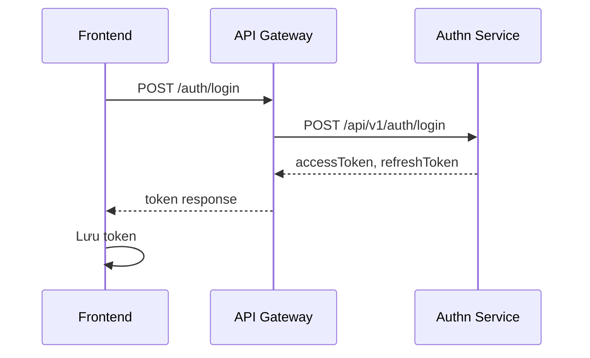
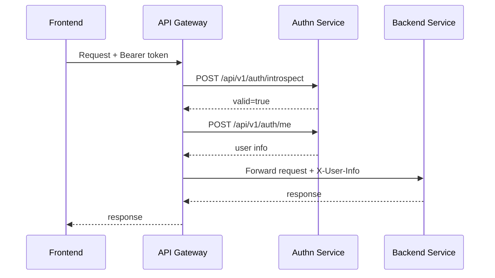
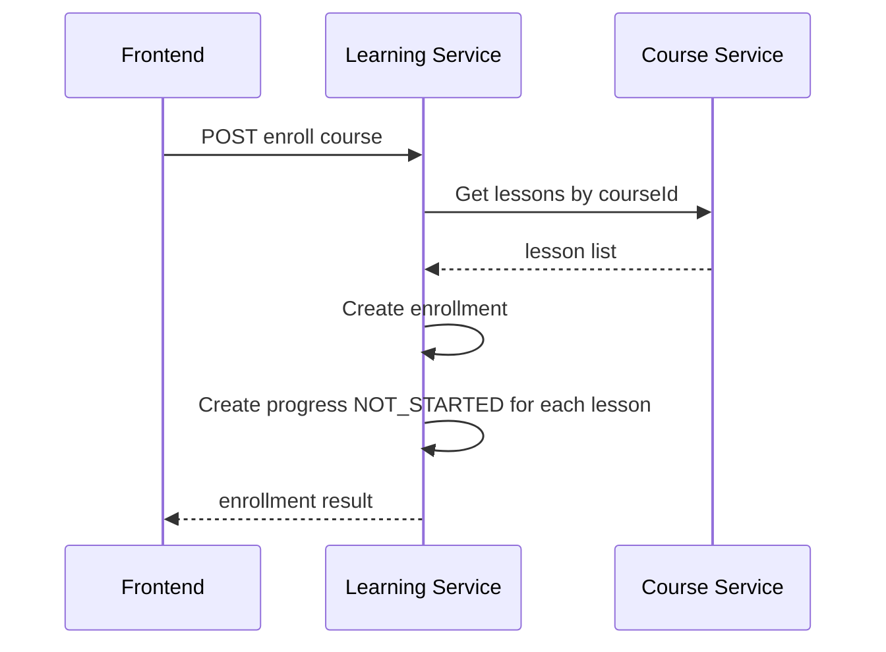
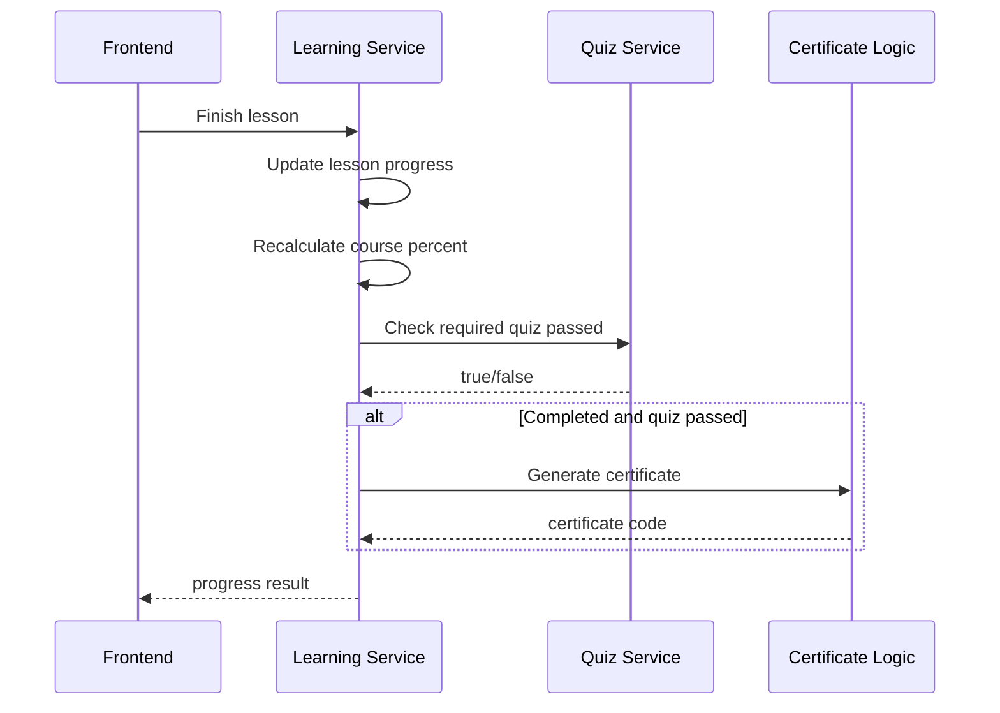

# LMS Mini - Frontend Render Specification

Tài liệu này dùng để render giao diện cho hệ thống LMS Mini. Nội dung tập trung vào chức năng, màn hình, luồng dữ liệu, luồng nghiệp vụ và các trạng thái UI cần có để frontend triển khai nhất quán với backend.

## 1. Tổng Quan Hệ Thống

LMS Mini là hệ thống học trực tuyến gồm các nhóm nghiệp vụ chính:

- Xác thực và tài khoản người dùng.
- Phân quyền và quản lý quyền.
- Quản lý khóa học, danh mục, bài học và tài nguyên bài học.
- Đăng ký khóa học, theo dõi tiến độ học tập.
- Làm quiz, kiểm tra điều kiện hoàn thành khóa học.
- Sinh và tra cứu chứng chỉ.
- Thông báo cho người dùng.

Frontend nên chia giao diện theo 3 nhóm người dùng:

- Student: học viên đăng ký khóa học, học bài, làm quiz, xem tiến độ, nhận chứng chỉ.
- Instructor/Admin: quản lý khóa học, bài học, quiz, danh mục, tài nguyên.
- System/Admin: quản lý user, quyền, role, thông báo và báo cáo.

## 2. Cấu Trúc Điều Hướng Gợi Ý

### Public

- Đăng nhập.
- Đăng ký.
- Xác thực OTP.
- Danh sách khóa học công khai.
- Chi tiết khóa học công khai.
- Tra cứu chứng chỉ theo mã.

### Student

- Dashboard học tập.
- Khóa học của tôi.
- Chi tiết khóa học đã đăng ký.
- Trình học bài.
- Quiz của khóa học/bài học.
- Tiến độ học tập.
- Chứng chỉ của tôi.
- Hồ sơ cá nhân.
- Đổi mật khẩu.

### Admin/Instructor

- Dashboard quản trị.
- Quản lý danh mục khóa học.
- Quản lý khóa học.
- Quản lý bài học.
- Quản lý tài nguyên bài học.
- Quản lý quiz.
- Quản lý câu hỏi/câu trả lời.
- Quản lý enrollment.
- Quản lý chứng chỉ.
- Quản lý thông báo.
- Quản lý quyền và tài khoản staff.

## 3. Danh Sách Chức Năng Theo Module

### 3.1 Authn - Xác Thực

Chức năng cần render:

- Đăng ký tài khoản.
- Gửi OTP đăng ký.
- Xác thực OTP.
- Đăng nhập.
- Refresh token.
- Đăng xuất.
- Đổi mật khẩu.
- Lấy thông tin người dùng hiện tại.

API gateway style gợi ý:

| Chức năng | Method | API |
|---|---:|---|
| Đăng ký | POST | `/auth/register` |
| Đăng nhập | POST | `/auth/login` |
| Đăng nhập alias | POST | `/auth/token` |
| Refresh token | POST | `/auth/refresh` |
| Đăng xuất | POST | `/auth/logout` |
| Validate token | POST | `/auth/introspect` |
| User info | POST | `/auth/userinfo` |
| Gửi OTP | POST | `/auth/otp-register` |
| Xác thực OTP | POST | `/auth/otp-verify` |

UI cần có:

- Form login: username/email, password.
- Form register: username, email, first name, last name, password.
- Form OTP: email, OTP code, nút gửi lại OTP.
- Form change password: mật khẩu cũ, mật khẩu mới, xác nhận mật khẩu mới.
- Trạng thái lỗi: sai mật khẩu, tài khoản không tồn tại, OTP sai/hết hạn, token hết hạn.

### 3.2 Authorization - Quyền Và Staff

Chức năng cần render:

- Danh sách permission.
- Danh sách staff account.
- Tạo staff account.
- Xem chi tiết quyền của staff.
- Cập nhật quyền staff.
- Cập nhật trạng thái staff.
- Reset mật khẩu staff.

API gateway style gợi ý:

| Chức năng | Method | API |
|---|---:|---|
| Danh sách permission | GET | `/admin/permissions` |
| Danh sách staff | GET | `/admin/permissions/staff` |
| Tạo staff | POST | `/admin/permissions/staff` |
| Chi tiết quyền staff | GET | `/admin/permissions/staff/{accountId}` |
| Cập nhật quyền staff | PUT | `/admin/permissions/staff/{accountId}` |
| Cập nhật trạng thái staff | PUT | `/admin/permissions/staff/{accountId}/status` |
| Reset mật khẩu staff | PUT | `/admin/permissions/staff/{accountId}/reset-password` |

UI cần có:

- Bảng staff: tên, email, role/quyền, trạng thái, ngày tạo.
- Modal tạo staff.
- Màn hình chi tiết staff với permission dạng checkbox group.
- Nút khóa/mở tài khoản.
- Nút reset mật khẩu.

### 3.3 Course - Khóa Học

Chức năng cần render:

- Danh sách khóa học.
- Tìm kiếm, lọc khóa học theo danh mục/trạng thái.
- Chi tiết khóa học.
- Tạo khóa học.
- Cập nhật khóa học.
- Xóa mềm khóa học.
- Upload ảnh khóa học.
- Đếm số bài học trong khóa học.

UI cần có:

- Card khóa học: ảnh, tên, mô tả ngắn, trạng thái, số bài học, tiến độ nếu đã đăng ký.
- Trang chi tiết: ảnh cover, mô tả, danh sách bài học, nút đăng ký/học tiếp.
- Admin form: tên, mã, mô tả, category, status, thumbnail.

### 3.4 Course Category - Danh Mục Khóa Học

Chức năng cần render:

- Danh sách danh mục.
- Tạo danh mục.
- Cập nhật danh mục.
- Xóa mềm danh mục.

UI cần có:

- Bảng danh mục: name, code, description, status.
- Form tạo/sửa danh mục.
- Bộ lọc theo status.

### 3.5 Lesson - Bài Học

Chức năng cần render:

- Danh sách bài học theo khóa học.
- Tạo bài học.
- Cập nhật bài học.
- Xóa mềm bài học.
- Bắt đầu bài học.
- Hoàn thành bài học.

UI cần có:

- Danh sách bài học dạng sidebar trong course player.
- Trạng thái bài học: Not Started, In Progress, Completed.
- Nội dung bài học ở vùng chính.
- Nút bắt đầu, hoàn thành, chuyển bài kế tiếp.

### 3.6 Lesson Resource - Tài Nguyên Bài Học

Chức năng cần render:

- Danh sách tài nguyên của bài học.
- Upload tài nguyên.
- Xem/tải tài nguyên.
- Xóa tài nguyên.

UI cần có:

- Khu tài liệu đính kèm trong bài học.
- Preview video/file nếu có thể.
- Trạng thái upload: uploading, success, failed.

### 3.7 Enrollment - Đăng Ký Khóa Học

Chức năng cần render:

- Đăng ký khóa học.
- Xem khóa học đã đăng ký.
- Kiểm tra user đã enroll khóa học chưa.
- Cập nhật tiến độ enrollment.

Luồng quan trọng:

1. Student nhấn đăng ký khóa học.
2. Backend tạo enrollment.
3. Backend khởi tạo learning progress cho toàn bộ lesson trong course với trạng thái `NOT_STARTED`.
4. Frontend chuyển nút từ `Đăng ký` sang `Vào học`.
5. Dashboard hiển thị khóa học trong mục `Khóa học của tôi`.

UI cần có:

- Button trạng thái:
  - Chưa đăng ký: `Đăng ký học`.
  - Đã đăng ký nhưng chưa học: `Bắt đầu học`.
  - Đang học: `Tiếp tục học`.
  - Hoàn thành: `Xem chứng chỉ`.

### 3.8 Learning Progress - Tiến Độ Học

Chức năng cần render:

- Start lesson.
- Finish lesson.
- Hiển thị phần trăm hoàn thành khóa học.
- Kiểm tra điều kiện hoàn thành: đủ lesson và quiz bắt buộc.

Luồng start lesson:

1. User vào lesson.
2. Frontend gọi API start lesson.
3. Backend chỉ cho start nếu progress đang `NOT_STARTED`.
4. Progress chuyển sang `IN_PROGRESS`.
5. UI highlight bài đang học.

Luồng finish lesson:

1. User bấm hoàn thành bài học.
2. Backend kiểm tra enrollment tồn tại với `userId` và `courseId`.
3. Backend cập nhật lesson progress thành `COMPLETED`.
4. Backend cập nhật progress percent của enrollment.
5. Nếu đạt 100%, backend kiểm tra quiz bắt buộc.
6. Nếu đủ điều kiện, backend sinh certificate.

UI cần có:

- Progress bar theo course.
- Checklist lesson.
- Badge trạng thái từng bài.
- Toast khi hoàn thành bài học.
- Warning nếu chưa pass quiz bắt buộc.

### 3.9 Quiz

Chức năng cần render:

- Danh sách quiz theo course/lesson.
- Quiz bắt buộc để hoàn thành khóa học.
- Làm quiz.
- Nộp bài.
- Xem kết quả pass/fail.

Luồng làm quiz:

1. User mở quiz.
2. Frontend lấy danh sách câu hỏi/câu trả lời.
3. User chọn đáp án.
4. Frontend submit attempt.
5. Backend tính điểm và trả kết quả.
6. Nếu quiz required và passed, course completion có thể được mở khóa.

UI cần có:

- Timer nếu backend có duration.
- Câu hỏi một lựa chọn/nhiều lựa chọn.
- Màn hình kết quả: điểm, pass/fail, số câu đúng.
- Badge `Required` cho quiz bắt buộc.

### 3.10 Certificate - Chứng Chỉ

Chức năng cần render:

- Danh sách chứng chỉ của user.
- Tự sinh chứng chỉ khi hoàn thành khóa học.
- Tra cứu chứng chỉ theo code.
- Hiển thị trạng thái chứng chỉ: active, expired, revoked.
- Hiển thị ngày cấp và ngày hết hạn.

Luồng sinh chứng chỉ:

1. Enrollment đạt 100%.
2. Backend kiểm tra toàn bộ lesson completed.
3. Backend kiểm tra quiz bắt buộc đã pass.
4. Backend sinh certificate code dạng ví dụ: `LMS-2026-A91F3C7B`.
5. Backend lưu certificate.
6. Frontend hiển thị CTA `Xem chứng chỉ`.

UI cần có:

- Certificate card: code, course name, issued date, expired date, status.
- Trang verify public: nhập code, hiển thị hợp lệ/không hợp lệ.
- Nút copy certificate code.

### 3.11 Notice - Thông Báo

Chức năng cần render:

- Danh sách thông báo.
- Gửi thông báo theo user.
- Gửi thông báo theo role.
- Đánh dấu đã đọc.

UI cần có:

- Bell notification trên header.
- Notification dropdown.
- Trang danh sách thông báo.
- Badge unread count.

## 4. Luồng Dữ Liệu Tổng Quát

### 4.1 Luồng Đăng Nhập



### 4.2 Luồng Gọi API Có Token



### 4.3 Luồng Đăng Ký Khóa Học



### 4.4 Luồng Hoàn Thành Khóa Học



## 5. Báo Cáo Luồng Nghiệp Vụ

### Student Journey

1. User đăng ký tài khoản.
2. User xác thực OTP nếu cần.
3. User đăng nhập.
4. User xem danh sách khóa học.
5. User mở chi tiết khóa học.
6. User đăng ký khóa học.
7. Hệ thống khởi tạo progress cho toàn bộ bài học.
8. User học từng bài.
9. User làm quiz bắt buộc.
10. User hoàn thành 100% khóa học.
11. Hệ thống sinh chứng chỉ.
12. User tra cứu hoặc chia sẻ certificate code.

### Admin/Instructor Journey

1. Admin đăng nhập.
2. Admin tạo danh mục khóa học.
3. Admin tạo khóa học.
4. Admin tạo bài học cho khóa học.
5. Admin upload tài nguyên bài học.
6. Admin tạo quiz/câu hỏi/câu trả lời.
7. Admin đánh dấu quiz required nếu cần.
8. Admin publish khóa học.
9. Admin theo dõi enrollment/progress.
10. Admin quản lý chứng chỉ và thông báo.

### Permission Journey

1. Admin xem danh sách permission.
2. Admin tạo staff account.
3. Admin gán permission cho staff.
4. Staff đăng nhập.
5. Gateway validate token.
6. Backend đọc user/role/permission từ header hoặc token.
7. Staff chỉ nhìn thấy các màn hình được cấp quyền.

## 6. Data Model FE Nên Chuẩn Hóa

### User

```ts
type User = {
  id: string;
  username: string;
  email?: string;
  fullName?: string;
  roleCode?: string;
  status?: string;
};
```

### Course

```ts
type Course = {
  id: string;
  name: string;
  code: string;
  description?: string;
  categoryId?: string;
  status: "ACTIVE" | "INACTIVE" | "DRAFT";
  thumbnailUrl?: string;
  lessonCount?: number;
};
```

### LessonProgress

```ts
type LessonProgress = {
  id: string;
  courseId: string;
  lessonId: string;
  status: "NOT_STARTED" | "IN_PROGRESS" | "COMPLETED";
};
```

### Enrollment

```ts
type Enrollment = {
  id: string;
  userId: string;
  courseId: string;
  progressPercent: number;
  status: "ACTIVE" | "COMPLETED" | "CANCELLED";
};
```

### Certificate

```ts
type Certificate = {
  id: string;
  code: string;
  userId: string;
  courseId: string;
  issuedAt: string;
  expiredAt?: string;
  status: "ACTIVE" | "EXPIRED" | "REVOKED";
};
```

## 7. UI State Cần Có

Mỗi màn hình gọi API nên có đủ các state:

- Loading: skeleton/table shimmer.
- Empty: chưa có dữ liệu.
- Error: lỗi tải dữ liệu hoặc lỗi nghiệp vụ.
- Success: toast khi thao tác thành công.
- Confirm: xác nhận trước khi xóa, logout, reset password.
- Forbidden: không đủ quyền.
- Unauthorized: token hết hạn, redirect login.

## 8. Quy Ước Render Form

- Required field hiển thị dấu `*`.
- Validate ở frontend trước khi gọi API.
- API error từ backend hiển thị gần field nếu xác định được field, còn lại hiển thị toast.
- Form tạo/sửa dùng chung component nếu field giống nhau.
- Nút submit disable khi loading.
- Không mất dữ liệu form khi API lỗi.

## 9. Quy Ước Render Table

- Có search nếu dữ liệu nhiều.
- Có filter status.
- Có pagination.
- Có cột action ở cuối.
- Action thường gặp: view, edit, delete, activate/deactivate.
- Mỗi row nên có `id` ổn định để render list.

## 10. Quy Ước Token Và Header

Frontend gửi token qua header:

```http
Authorization: Bearer <accessToken>
```

Gateway sau khi validate token có thể forward thêm:

```http
X-User-Info: <base64-json-user>
X-User: <username>
X-Role-Code: <roleCode>
```

Frontend không nên tự tin vào role ở local storage để bảo mật. Role ở frontend chỉ dùng để ẩn/hiện menu cho trải nghiệm tốt hơn; backend vẫn là nơi quyết định quyền thật.

## 11. Gợi Ý Render Tốt Hơn

- Dashboard student nên có `continue learning` ở đầu trang.
- Course detail nên hiển thị rõ số bài học, quiz bắt buộc, trạng thái chứng chỉ.
- Lesson player nên có sidebar lesson cố định và progress bar ở trên.
- Quiz nên autosave đáp án local tạm thời để tránh mất dữ liệu khi reload.
- Certificate verify nên là public page, nhập code là xem được trạng thái.
- Admin page nên dùng layout table dày, ít khoảng trắng, dễ thao tác nhiều dữ liệu.
- Các badge trạng thái nên thống nhất màu:
  - ACTIVE/COMPLETED/PASSED: xanh.
  - IN_PROGRESS: xanh dương.
  - NOT_STARTED/DRAFT: xám.
  - FAILED/EXPIRED/REVOKED: đỏ.
  - REQUIRED: vàng/cam.

## 12. Checklist Render Theo Màn Hình

- Login page.
- Register page.
- OTP verify page.
- Student dashboard.
- Public course list.
- Course detail.
- My courses.
- Lesson player.
- Quiz attempt page.
- Quiz result page.
- Certificate verify page.
- My certificates.
- Admin dashboard.
- Course category management.
- Course management.
- Lesson management.
- Lesson resource management.
- Quiz management.
- Question/answer management.
- Enrollment management.
- Certificate management.
- Notice management.
- Permission/staff management.

## 13. Ghi Chú Cho FE

- API gateway có thể expose path thân thiện kiểu Continental như `/auth/login`.
- Một số service nội bộ vẫn có path `/api/v1/...`; frontend nên gọi qua gateway, không gọi trực tiếp service.
- Các API `/internal/v1/...` chỉ dùng service-to-service, frontend không gọi.
- Khi nhận lỗi 401, frontend nên clear token và redirect login.
- Khi nhận lỗi 403, frontend hiển thị trang không đủ quyền.
- Khi refresh token fail, bắt user đăng nhập lại.
