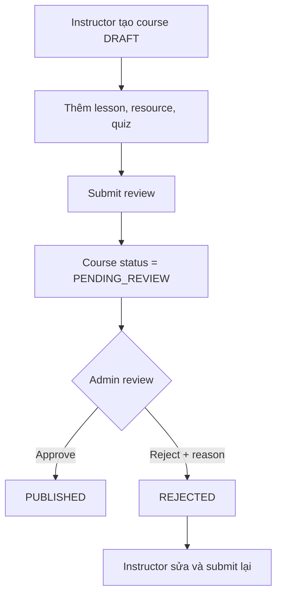
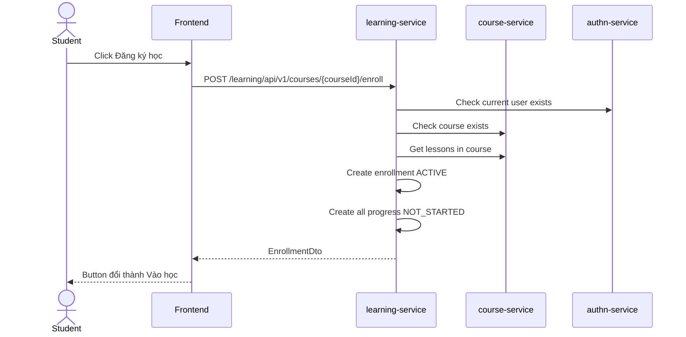
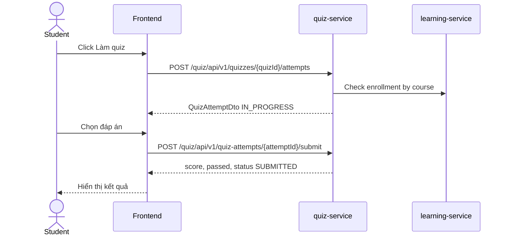
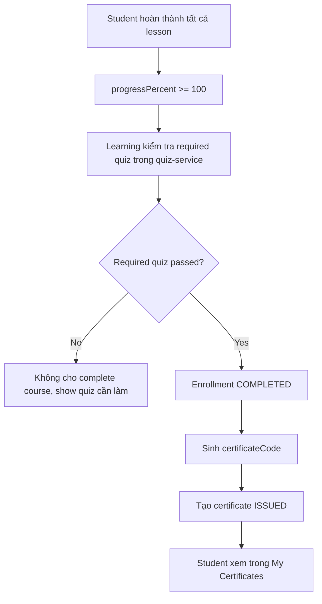
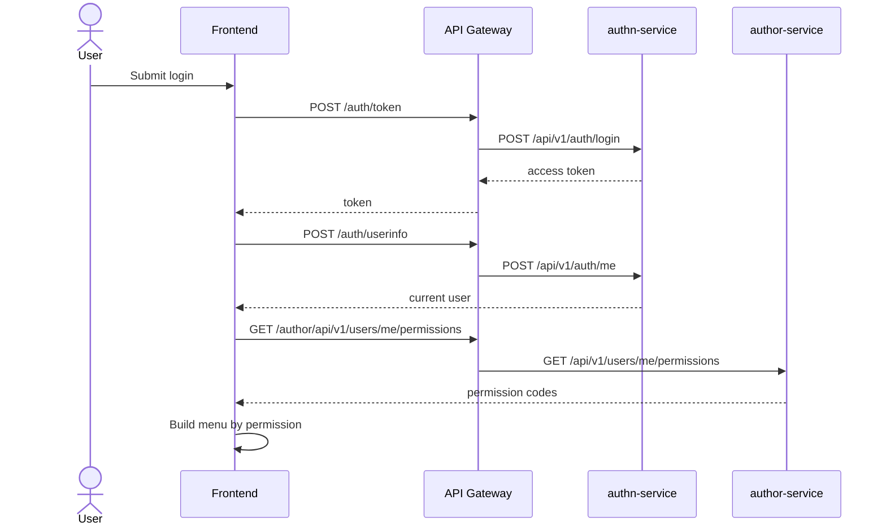
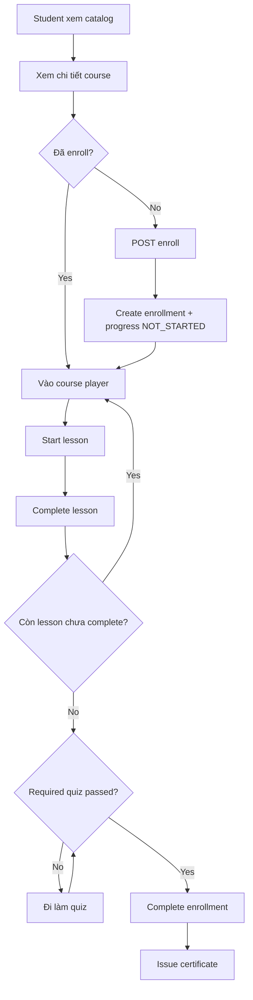
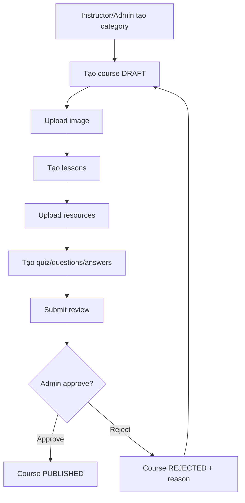
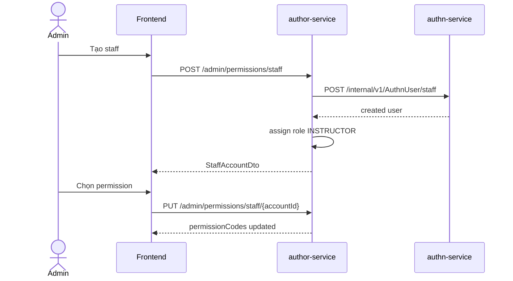

# LMS Mini - Frontend Render Specification

Tài liệu này dùng làm đầu vào để render giao diện frontend cho hệ thống LMS Mini. Mục tiêu là mô tả đủ màn hình, chức năng, luồng dữ liệu, quyền truy cập, trạng thái UI và API đang có trong backend để có thể dựng giao diện admin, instructor và student một cách nhất quán.

## 1. Phạm Vi

Hệ thống hiện có các service chính:

| Service | Gateway prefix | Vai trò |
|---|---|---|
| api-gateway | `/` | Cổng vào hệ thống, xác thực token, chuyển tiếp request, swagger tổng |
| authn-service | `/auth`, `/authn` | Đăng nhập, đăng ký, OTP, token, đổi mật khẩu, thông tin user |
| author-service | `/admin/permissions`, `/author`, `/staff-activity` | Role, permission, staff account, quyền theo user |
| course-service | `/course` | Khóa học, danh mục, bài học, tài nguyên, ảnh |
| learning-service | `/learning` | Enrollment, tiến độ học, chứng chỉ |
| quiz-service | `/quiz` | Quiz, câu hỏi, đáp án, attempt |
| notice-service | `/notice` | Entity thông báo đã có, controller public chưa hoàn thiện |
| billing-service | `/billing` | Thanh toán qua PayOS, hóa đơn, lịch sử giao dịch, webhook paid và auto enroll |

Frontend nên chỉ gọi qua API Gateway, không gọi trực tiếp port service.

## 2. Quy Ước API

### 2.1 Base URL

Dev local:

```txt
http://localhost:8080
```

Swagger gateway:

```txt
http://localhost:8080/swagger-ui.html
```

### 2.2 Request Wrapper

Các API create/update đa số dùng `BaseRequest<T>`:

```json
{
  "data": {},
  "channel": "WEB",
  "signature": ""
}
```

Frontend nên tạo helper:

```ts
function wrap<T>(data: T) {
  return { data, channel: "WEB", signature: "" };
}
```

### 2.3 Response Wrapper

Backend trả về dạng:

```json
{
  "data": {},
  "status": "OK",
  "errorCode": "EV-200",
  "message": "OK"
}
```

Quy ước xử lý UI:

| Trường hợp | UI |
|---|---|
| HTTP 2xx và `errorCode = EV-200` | Hiển thị data |
| HTTP 401 | Xóa token, chuyển về login |
| HTTP 403 | Hiển thị trang không có quyền |
| `data = null` và `errorCode != EV-200` | Toast lỗi bằng `message` |
| Page response | Dùng `data.content`, `data.totalElements`, `data.totalPages`, `data.number`, `data.size` |

### 2.4 Auth Header

Sau khi login, lưu access token và gửi:

```txt
Authorization: Bearer <accessToken>
Accept-Language: vi
```

Không truyền `userId` cho các màn hình của user hiện tại. Các API dạng `my`, `me`, start lesson, finish lesson, quiz attempt đều lấy user từ token qua `SecurityContextHolder`.

## 3. Role Và Permission

### 3.1 Role

| Role | Ý nghĩa | Giao diện chính |
|---|---|---|
| ADMIN | Quản trị toàn hệ thống | Admin dashboard, staff, permission, review course, toàn bộ quản lý |
| INSTRUCTOR | Giảng viên/staff | Quản lý course, lesson, resource, quiz, xem enrollment |
| STUDENT | Học viên | Học khóa học, làm quiz, xem chứng chỉ |

### 3.2 Permission Seed Hiện Có

| Nhóm | Permission |
|---|---|
| User | `USER_VIEW`, `USER_CREATE`, `USER_UPDATE`, `USER_PROFILE_VIEW`, `USER_PASSWORD_CHANGE` |
| Role/Permission | `ROLE_VIEW`, `ROLE_MANAGE`, `PERMISSION_VIEW`, `PERMISSION_MANAGE` |
| Staff | `STAFF_VIEW`, `STAFF_CREATE`, `STAFF_UPDATE`, `STAFF_STATUS_UPDATE`, `STAFF_PASSWORD_RESET`, `STAFF_ACTIVITY_VIEW` |
| Course | `COURSE_VIEW`, `COURSE_MANAGE`, `COURSE_REVIEW` |
| Category | `CATEGORY_VIEW`, `CATEGORY_MANAGE` |
| Lesson | `LESSON_VIEW`, `LESSON_MANAGE` |
| Resource/Image | `RESOURCE_VIEW`, `RESOURCE_MANAGE`, `IMAGE_VIEW`, `IMAGE_MANAGE` |
| Enrollment | `ENROLLMENT_VIEW`, `ENROLLMENT_ENROLL`, `ENROLLMENT_MANAGE` |
| Learning | `LEARNING_PROGRESS_VIEW`, `LEARNING_PROGRESS_UPDATE` |
| Quiz | `QUIZ_VIEW`, `QUIZ_MANAGE`, `QUESTION_MANAGE`, `ANSWER_MANAGE`, `QUIZ_ATTEMPT` |
| Certificate | `CERTIFICATE_VIEW`, `CERTIFICATE_MANAGE`, `CERTIFICATE_VERIFY` |
| Payment | `PAYMENT_VIEW`, `PAYMENT_CREATE`, `PAYMENT_MANAGE` |
| Notice/Device | `NOTICE_VIEW`, `NOTICE_SEND`, `DEVICE_MANAGE` |

### 3.3 Render Theo Permission

Frontend nên lấy quyền hiện tại sau login:

```txt
GET /author/api/v1/users/me/permissions
GET /author/api/v1/users/me/roles
```

Ẩn menu, nút hành động, tab và route nếu thiếu permission. Với route nhạy cảm vẫn cần backend chặn bằng `@PreAuthorize`, frontend chỉ giúp UX tốt hơn.

## 4. Sitemap Tổng

### 4.1 Public

| Route UI | Màn hình | Chức năng |
|---|---|---|
| `/login` | Đăng nhập | Login bằng username/password |
| `/register` | Đăng ký | Tạo tài khoản student |
| `/verify-otp` | Xác thực OTP | Nhập OTP khi đăng ký |
| `/courses` | Catalog khóa học | Xem khóa học đã publish |
| `/courses/:id` | Chi tiết khóa học | Xem mô tả, bài học, quiz nếu có |
| `/certificates/verify` | Tra cứu chứng chỉ | Nhập certificate code |

### 4.2 Student

| Route UI | Permission | Màn hình |
|---|---|---|
| `/student/dashboard` | `ENROLLMENT_VIEW` | Tổng quan học tập |
| `/student/my-courses` | `ENROLLMENT_VIEW` | Khóa học của tôi |
| `/student/courses/:courseId/learn` | `LESSON_VIEW`, `LEARNING_PROGRESS_UPDATE` | Trình học bài |
| `/student/quizzes/:quizId/attempt` | `QUIZ_ATTEMPT` | Làm quiz |
| `/student/certificates` | `CERTIFICATE_VIEW` | Chứng chỉ của tôi |
| `/payment/success` | `PAYMENT_VIEW` | Kết quả thanh toán thành công |
| `/payment/cancel` | `PAYMENT_VIEW` | Thanh toán bị hủy |
| `/profile` | `USER_PROFILE_VIEW` | Hồ sơ hiện tại |
| `/change-password` | `USER_PASSWORD_CHANGE` | Đổi mật khẩu |

### 4.3 Instructor

| Route UI | Permission | Màn hình |
|---|---|---|
| `/instructor/dashboard` | `COURSE_VIEW` | Tổng quan giảng viên |
| `/instructor/courses` | `COURSE_VIEW` | Khóa học của giảng viên |
| `/instructor/courses/new` | `COURSE_MANAGE` | Tạo khóa học |
| `/instructor/courses/:id/edit` | `COURSE_MANAGE` | Sửa khóa học |
| `/instructor/courses/:id/lessons` | `LESSON_VIEW` | Quản lý bài học |
| `/instructor/lessons/:id/resources` | `RESOURCE_VIEW` | Quản lý tài nguyên |
| `/instructor/quizzes` | `QUIZ_VIEW` | Quản lý quiz |
| `/instructor/quizzes/:id/questions` | `QUESTION_MANAGE`, `ANSWER_MANAGE` | Câu hỏi và đáp án |
| `/instructor/enrollments` | `ENROLLMENT_VIEW` | Theo dõi học viên |

### 4.4 Admin

| Route UI | Permission | Màn hình |
|---|---|---|
| `/admin/dashboard` | nhiều quyền | Tổng quan hệ thống |
| `/admin/categories` | `CATEGORY_VIEW` | Danh mục khóa học |
| `/admin/courses` | `COURSE_VIEW` | Toàn bộ khóa học |
| `/admin/course-review` | `COURSE_REVIEW` | Duyệt/từ chối khóa học |
| `/admin/permissions` | `PERMISSION_VIEW` | Danh sách permission |
| `/admin/roles` | `ROLE_VIEW` | Danh sách role |
| `/admin/staff` | `STAFF_VIEW` | Staff account |
| `/admin/staff/:accountId` | `STAFF_VIEW` | Chi tiết staff |
| `/admin/staff-activity` | `STAFF_ACTIVITY_VIEW` | Hoạt động staff |
| `/admin/certificates` | `CERTIFICATE_MANAGE` | Quản lý chứng chỉ |
| `/admin/notices` | `NOTICE_VIEW` | Quản lý thông báo, khi API notice hoàn thiện |

## 5. Authn Module

### 5.1 API

| Chức năng | Method | Gateway API | Body |
|---|---:|---|---|
| Login alias | POST | `/auth/token` | `{ username, password }` |
| Login raw | POST | `/auth/login` | `{ username, password }` |
| Refresh token | POST | `/auth/refresh` | `{ token }` |
| Refresh raw | POST | `/auth/refresh-token` | `{ token }` |
| Logout | POST | `/auth/logout` | `{ token }` |
| Introspect | POST | `/auth/introspect` | `{ token }` |
| Current user info | POST | `/auth/userinfo` | token header |
| Current user info raw | POST | `/auth/me` | token header |
| Change password | POST | `/auth/change-password` | `{ oldPassword, newPassword, confirmPassword }` |
| Send OTP register | POST | `/auth/otp-register` | `{ email }` |
| Verify OTP | POST | `/auth/otp-verify` | `{ email, inputOtp, expectedType }` |
| Register | POST | `/auth/register` | `{ firstName, lastName, email, username, password, phone }` |

### 5.2 Login Screen

Fields:

| Field | Type | Required |
|---|---|---|
| username | text | yes |
| password | password | yes |

States:

| State | UI |
|---|---|
| idle | Form enabled |
| loading | Disable submit, show spinner |
| success | Save token, load `/auth/userinfo`, load `/author/api/v1/users/me/permissions`, redirect by role |
| invalid credentials | Show message near form |
| locked/inactive | Show account status message |

### 5.3 Register And OTP

Flow:

1. User nhập thông tin đăng ký.
2. Gọi `/auth/otp-register` nếu UI muốn xác thực email trước.
3. User nhập OTP ở `/verify-otp`.
4. Gọi `/auth/otp-verify`.
5. Gọi `/auth/register`.
6. Chuyển về login hoặc auto login tùy UX.

### 5.4 Change Password

Route: `/change-password`

Fields: `oldPassword`, `newPassword`, `confirmPassword`.

Validation UI:

| Rule | Message |
|---|---|
| newPassword khác confirmPassword | Mật khẩu xác nhận không khớp |
| newPassword quá ngắn | Mật khẩu mới chưa đủ mạnh |
| oldPassword sai | Mật khẩu cũ không đúng |

## 6. Authorization Module

### 6.1 API

Gateway alias:

| Chức năng | Method | Gateway API | Permission |
|---|---:|---|---|
| Danh sách permission | GET | `/admin/permissions` | `PERMISSION_VIEW` |
| Danh sách staff | GET | `/admin/permissions/staff` | `STAFF_VIEW` |
| Tạo staff/instructor | POST | `/admin/permissions/staff` | `STAFF_CREATE` |
| Chi tiết staff | GET | `/admin/permissions/staff/{accountId}` | `STAFF_VIEW` |
| Cập nhật quyền staff | PUT | `/admin/permissions/staff/{accountId}` | `STAFF_UPDATE` |
| Cập nhật trạng thái staff | PUT | `/admin/permissions/staff/{accountId}/status` | `STAFF_STATUS_UPDATE` |
| Reset mật khẩu staff | PUT | `/admin/permissions/staff/{accountId}/reset-password` | `STAFF_PASSWORD_RESET` |

Raw author routes:

| Chức năng | Method | API | Permission |
|---|---:|---|---|
| Danh sách role | GET | `/author/api/v1/roles` | `ROLE_VIEW` |
| Chi tiết role | GET | `/author/api/v1/roles/{roleCode}` | `ROLE_VIEW` |
| Gán permission cho role | POST | `/author/api/v1/roles/{roleCode}/permissions` | `PERMISSION_MANAGE` |
| Gán role cho user | POST | `/author/api/v1/users/{userId}/roles` | `ROLE_MANAGE` |
| Gán role theo body | POST | `/author/api/v1/user-roles` | `ROLE_MANAGE` |
| Role của user | GET | `/author/api/v1/users/{userId}/roles` | `USER_VIEW` |
| Role của tôi | GET | `/author/api/v1/users/me/roles` | `USER_PROFILE_VIEW` |
| Permission của tôi | GET | `/author/api/v1/users/me/permissions` | `USER_PROFILE_VIEW` |
| Hoạt động staff của tôi | GET | `/staff-activity/me` | `STAFF_ACTIVITY_VIEW` |
| Hoạt động staff | GET | `/staff-activity` | `STAFF_ACTIVITY_VIEW` |

### 6.2 Staff Account Screen

List columns:

| Column | Source |
|---|---|
| User ID | `userId` |
| Username | `username` |
| Full name | `fullName` |
| Email | `email` |
| Phone | `phone` |
| Role | `roleCode` |
| Permission count | `permissionCodes.length` |
| Actions | view, edit permissions, lock/unlock, reset password |

Create staff form:

```json
{
  "username": "teacher01",
  "email": "teacher01@gmail.com",
  "password": "123456",
  "firstName": "Teacher",
  "lastName": "One",
  "phone": "0900000001"
}
```

Business note: tạo staff sẽ gọi authn-service tạo user, sau đó author-service gán role `INSTRUCTOR`.

### 6.3 Permission Assignment UI

Render permission theo nhóm nghiệp vụ, checkbox theo `permissionCodes`.

Payload cập nhật quyền staff:

```json
{
  "data": {
    "permissionCodes": ["COURSE_VIEW", "COURSE_MANAGE"]
  },
  "channel": "WEB",
  "signature": ""
}
```

Payload gán permission cho role:

```json
{
  "data": {
    "permissionCodes": ["COURSE_VIEW", "LESSON_VIEW"]
  },
  "channel": "WEB",
  "signature": ""
}
```

## 7. Course Module

### 7.1 Course API

| Chức năng | Method | Gateway API | Permission |
|---|---:|---|---|
| Danh sách course | GET | `/course/api/v1/courses` | `COURSE_VIEW` |
| Chi tiết course | GET | `/course/api/v1/courses/{id}` | `COURSE_VIEW` |
| Tạo course | POST | `/course/api/v1/courses` | `COURSE_MANAGE` |
| Cập nhật course | POST | `/course/api/v1/courses/{id}` | `COURSE_MANAGE` |
| Xóa course | DELETE | `/course/api/v1/courses/{id}` | `COURSE_MANAGE` |
| Xóa nhiều course | DELETE | `/course/api/v1/courses` | `COURSE_MANAGE` |
| Submit review | POST | `/course/api/v1/courses/{id}/submit-review` | `COURSE_MANAGE` |
| Approve | POST | `/course/api/v1/courses/{id}/approve` | `COURSE_REVIEW` |
| Reject | POST | `/course/api/v1/courses/{id}/reject` | `COURSE_REVIEW` |
| Archive | POST | `/course/api/v1/courses/{id}/archive` | `COURSE_MANAGE` |
| Upload course image | POST | `/course/api/v1/courses/{id}/images` | `IMAGE_MANAGE` |

### 7.2 Course Fields

| Field | Type | Render |
|---|---|---|
| categoryId | select | lấy từ category list |
| instructorId | text/select | staff/instructor id |
| name | text | required |
| code | text | required, unique |
| description | rich textarea | optional |
| level | select | `BEGINNER`, `INTERMEDIATE`, `ADVANCED` |
| durationMinutes | number | phút |
| price | number/currency | VND |
| status | select/badge | `DRAFT`, `PENDING_REVIEW`, `PUBLISHED`, `REJECTED`, `ARCHIVED` |
| rejectReason | readonly/textarea | hiển thị khi rejected |
| publishedAt | datetime | readonly |

### 7.3 Course List UI

Filters:

| Filter | Type |
|---|---|
| keyword | text |
| categoryId | select |
| status | select |
| level | select |
| instructorId | select/text |

Card fields:

| Field | UI |
|---|---|
| image | thumbnail |
| name | title |
| level | badge |
| price | currency |
| durationMinutes | duration |
| status | badge |
| lesson count | secondary text |

Actions by role:

| Action | Student | Instructor | Admin |
|---|---|---|---|
| View detail | yes | yes | yes |
| Enroll | yes | no | optional |
| Edit | no | own course | yes |
| Submit review | no | yes | yes |
| Approve/reject | no | no | yes |
| Archive/delete | no | own course | yes |

### 7.4 Course Review Flow



Reject payload nên gửi reason theo `RejectCourseRequest`:

```json
{
  "courseId": "course-id",
  "reasonReject": "Thiếu nội dung bài học"
}
```

## 8. Category Module

### 8.1 API

| Chức năng | Method | Gateway API | Permission |
|---|---:|---|---|
| Danh sách category | GET | `/course/api/v1/course-categories` | `CATEGORY_VIEW` |
| Chi tiết category | GET | `/course/api/v1/course-categories/{id}` | `CATEGORY_VIEW` |
| Tạo category | POST | `/course/api/v1/course-categories` | `CATEGORY_MANAGE` |
| Cập nhật category | POST | `/course/api/v1/course-categories/{id}` | `CATEGORY_MANAGE` |
| Xóa category | DELETE | `/course/api/v1/course-categories/{id}` | `CATEGORY_MANAGE` |
| Xóa nhiều category | DELETE | `/course/api/v1/course-categories` | `CATEGORY_MANAGE` |

### 8.2 Fields

| Field | Type | Required |
|---|---|---|
| name | text | yes |
| code | text | yes |
| description | textarea | no |
| status | select `ACTIVE`, `INACTIVE` | yes |

## 9. Lesson Module

### 9.1 API

| Chức năng | Method | Gateway API | Permission |
|---|---:|---|---|
| Danh sách lesson | GET | `/course/api/v1/lessons` | `LESSON_VIEW` |
| Chi tiết lesson | GET | `/course/api/v1/lessons/{id}` | `LESSON_VIEW` |
| Tạo lesson | POST | `/course/api/v1/lessons` | `LESSON_MANAGE` |
| Cập nhật lesson | POST | `/course/api/v1/lessons/{id}` | `LESSON_MANAGE` |
| Xóa lesson | DELETE | `/course/api/v1/lessons/{id}` | `LESSON_MANAGE` |
| Xóa nhiều lesson | DELETE | `/course/api/v1/lessons` | `LESSON_MANAGE` |
| Lesson theo course | GET | `/course/api/v1/courses/{courseId}/lessons` | `LESSON_VIEW` |
| Tạo lesson trong course | POST | `/course/api/v1/courses/{courseId}/lessons` | `LESSON_MANAGE` |

### 9.2 Fields

| Field | Type | Render |
|---|---|---|
| courseId | hidden/select | từ course detail |
| title | text | required |
| code | text | optional |
| content | rich editor | bài học |
| videoUrl | url | video player |
| orderIndex | number | sort tăng dần |
| durationMinutes | number | phút |
| status | select | `DRAFT`, `ACTIVE`, `INACTIVE`, `ARCHIVED` |

### 9.3 Course Player UI

Layout:

| Area | Nội dung |
|---|---|
| Left sidebar | danh sách lesson theo `orderIndex`, trạng thái progress |
| Main content | video/content/resource |
| Right/top actions | start, complete, next lesson |
| Bottom | quiz liên quan lesson/course nếu có |

Lesson status badges:

| Learning status | UI |
|---|---|
| `NOT_STARTED` | xám, nút Bắt đầu |
| `IN_PROGRESS` | xanh dương, nút Hoàn thành |
| `COMPLETED` | xanh lá, readonly |

## 10. Lesson Resource Và Image Module

### 10.1 Lesson Resource API

| Chức năng | Method | Gateway API | Permission |
|---|---:|---|---|
| Danh sách resource | GET | `/course/api/v1/lesson-resources` | `RESOURCE_VIEW` |
| Chi tiết resource | GET | `/course/api/v1/lesson-resources/{id}` | `RESOURCE_VIEW` |
| Tạo resource | POST | `/course/api/v1/lesson-resources` | `RESOURCE_MANAGE` |
| Cập nhật resource | POST | `/course/api/v1/lesson-resources/{id}` | `RESOURCE_MANAGE` |
| Xóa resource | DELETE | `/course/api/v1/lesson-resources/{id}` | `RESOURCE_MANAGE` |
| Upload resource cho lesson | POST multipart | `/course/api/v1/lessons/{id}/resources` | `RESOURCE_MANAGE` |

Fields:

| Field | Type |
|---|---|
| lessonId | hidden/select |
| title | text |
| resourceType | `PDF`, `DOCX`, `LINK`, `VIDEO`, `IMAGE` |
| filePath | readonly/upload result |
| externalUrl | url |
| status | `ACTIVE`, `INACTIVE` |

### 10.2 Image API

| Chức năng | Method | Gateway API | Permission |
|---|---:|---|---|
| Danh sách image | GET | `/course/api/v1/images` | `IMAGE_VIEW` |
| Chi tiết image | GET | `/course/api/v1/images/{id}` | `IMAGE_VIEW` |
| Tạo image metadata | POST | `/course/api/v1/images` | `IMAGE_MANAGE` |
| Cập nhật image | POST | `/course/api/v1/images/{id}` | `IMAGE_MANAGE` |
| Xóa image | DELETE | `/course/api/v1/images/{id}` | `IMAGE_MANAGE` |

Fields:

| Field | Type |
|---|---|
| objectType | `COURSE`, `LESSON`, `USER`, `CERTIFICATE` |
| objectId | target id |
| fileName | text |
| filePath | text |
| fileUrl | url |
| contentType | MIME |
| fileSize | number |
| primaryImage | boolean |
| status | `ACTIVE`, `INACTIVE` |

## 11. Enrollment Module

### 11.1 API

| Chức năng | Method | Gateway API | Permission |
|---|---:|---|---|
| Enroll course | POST | `/learning/api/v1/courses/{courseId}/enroll` | `ENROLLMENT_ENROLL` |
| My courses | GET | `/learning/api/v1/my-courses` | `ENROLLMENT_VIEW` |
| Complete course | POST | `/learning/api/v1/courses/{courseId}/complete` | `LEARNING_PROGRESS_UPDATE` |

Internal:

| Chức năng | Method | Internal API | Dùng bởi |
|---|---:|---|---|
| Check enrollment theo course | GET | `/internal/v1/enrollment/{courseId}` | quiz-service |

### 11.2 Enrollment Fields

| Field | Type | UI |
|---|---|---|
| userId | readonly | lấy từ token, không nhập tay |
| courseId | course id | từ route |
| enrolledAt | datetime | readonly |
| completedAt | datetime | readonly |
| progressPercent | number | progress bar |
| status | badge | `ACTIVE`, `COMPLETED`, `CANCELLED` |

### 11.3 Enroll Flow



Button states:

| Condition | Button |
|---|---|
| chưa login | Đăng nhập để học |
| chưa enroll | Đăng ký học |
| enrolled, progress 0 | Bắt đầu học |
| enrolled, progress 1-99 | Tiếp tục học |
| completed | Xem chứng chỉ |

## 12. Learning Progress Module

### 12.1 API

| Chức năng | Method | Gateway API | Permission |
|---|---:|---|---|
| Start lesson | POST | `/learning/api/v1/lessons/{lessonId}/start` | `LEARNING_PROGRESS_UPDATE` |
| Complete lesson | POST | `/learning/api/v1/lessons/{lessonId}/complete` | `LEARNING_PROGRESS_UPDATE` |

### 12.2 Start Lesson Rules

Backend lấy user từ token. Frontend không truyền `userId`.

Flow:

1. User mở lesson trong course player.
2. Nếu progress là `NOT_STARTED`, show nút `Bắt đầu bài học`.
3. Gọi start lesson.
4. Backend kiểm tra enrollment của user với course chứa lesson.
5. Progress chuyển sang `IN_PROGRESS`.
6. UI mở nội dung học và highlight lesson.

Lưu ý: start lesson nên bắt lỗi nếu trạng thái không phải `NOT_STARTED`.

### 12.3 Complete Lesson Rules

Flow:

1. User đang ở lesson `IN_PROGRESS`.
2. Click `Hoàn thành bài học`.
3. Backend chuyển progress sang `COMPLETED`.
4. Backend tăng `progressPercent` của enrollment.
5. Nếu `progressPercent >= 100`, frontend gọi/hiển thị hành động hoàn thành course.
6. Backend kiểm tra quiz bắt buộc trước khi hoàn thành course.

UI khi lỗi:

| Lỗi | UI |
|---|---|
| chưa enroll | Toast: Bạn chưa đăng ký khóa học |
| lesson không tồn tại | Toast: Bài học không tồn tại |
| chưa start mà complete | Toast: Cần bắt đầu bài học trước |
| quiz bắt buộc chưa pass | Điều hướng tới quiz bắt buộc |

## 12.4 Payment Module

### API

| Chức năng | Method | Gateway API | Permission |
|---|---:|---|---|
| Tạo thanh toán khóa học | POST | `/billing/api/v1/course-payments` | `PAYMENT_CREATE` |
| Thanh toán của tôi | GET | `/billing/api/v1/payments/me` | `PAYMENT_VIEW` |
| Lịch sử giao dịch | GET | `/billing/api/v1/payments/history/me` | `PAYMENT_VIEW` |
| Chi tiết payment | GET | `/billing/api/v1/payments/{id}` | `PAYMENT_VIEW` |
| PayOS webhook | POST | `/billing/api/v1/payments/payos/webhook` | public, verify checksum |

## 12.5 Invoice Module

| Chức năng | Method | Gateway API | Permission |
|---|---:|---|---|
| Hóa đơn của tôi | GET | `/billing/api/v1/invoices/me` | `PAYMENT_VIEW` |
| Chi tiết hóa đơn | GET | `/billing/api/v1/invoices/{invoiceCode}` | `PAYMENT_VIEW` |
| Admin xem hóa đơn | GET | `/billing/api/v1/admin/invoices` | `PAYMENT_MANAGE` |

Create payment body:

```json
{
  "data": {
    "courseId": "course-id"
  },
  "channel": "WEB",
  "signature": ""
}
```

Flow:

1. Student bấm đăng ký khóa học trả phí.
2. Frontend gọi `/billing/api/v1/course-payments`.
3. Backend tạo payment `PENDING`, gọi PayOS và trả `providerCheckoutUrl`.
4. Frontend redirect sang `providerCheckoutUrl`.
5. PayOS thanh toán xong gọi webhook `/billing/api/v1/payments/payos/webhook`.
6. Billing-service verify checksum, đổi payment thành `PAID`, lưu hóa đơn trong cùng service, rồi gọi learning-service internal để auto enroll course.
7. PayOS redirect về `/payment/success`, frontend gọi lại `/learning/api/v1/my-courses` để kiểm tra course đã vào danh sách học.

## 13. Quiz Module

### 13.1 Quiz API

| Chức năng | Method | Gateway API | Permission |
|---|---:|---|---|
| Danh sách quiz | GET | `/quiz/api/v1/quiz` | `QUIZ_VIEW` |
| Chi tiết quiz | GET | `/quiz/api/v1/quiz/{id}` | `QUIZ_VIEW` |
| Tạo quiz | POST | `/quiz/api/v1/quiz` | `QUIZ_MANAGE` |
| Cập nhật quiz | POST | `/quiz/api/v1/quiz/{id}` | `QUIZ_MANAGE` |
| Xóa quiz | DELETE | `/quiz/api/v1/quiz/{id}` | `QUIZ_MANAGE` |
| Xóa nhiều quiz | DELETE | `/quiz/api/v1/quiz` | `QUIZ_MANAGE` |

Fields:

| Field | Type | UI |
|---|---|---|
| courseId | select | khóa học chứa quiz |
| lessonId | select | bài học liên quan |
| title | text | tên quiz |
| passScore | number | điểm đạt |
| maxAttempts | number | số lần làm tối đa |
| requiredToComplete | boolean | bắt buộc để hoàn thành course |
| status | select | `DRAFT`, `ACTIVE`, `INACTIVE`, `ARCHIVED` |

Giải thích `courseId` và `lessonId`: `courseId` dùng để kiểm tra điều kiện hoàn thành toàn khóa, còn `lessonId` dùng để gắn quiz vào bài học cụ thể trong course player.

### 13.2 Question API

| Chức năng | Method | Gateway API | Permission |
|---|---:|---|---|
| Danh sách question | GET | `/quiz/api/v1/questions` | `QUESTION_MANAGE` |
| Chi tiết question | GET | `/quiz/api/v1/questions/{id}` | `QUESTION_MANAGE` |
| Tạo question cho quiz | POST | `/quiz/api/v1/questions/quizzes/{id}` | `QUESTION_MANAGE` |
| Cập nhật question | POST | `/quiz/api/v1/questions/{id}` | `QUESTION_MANAGE` |
| Xóa question | DELETE | `/quiz/api/v1/questions/{id}` | `QUESTION_MANAGE` |

Fields:

| Field | Type |
|---|---|
| quizId | hidden |
| content | textarea |
| questionType | `SINGLE_CHOICE` |
| score | number |
| orderIndex | number |

### 13.3 Answer API

| Chức năng | Method | Gateway API | Permission |
|---|---:|---|---|
| Danh sách answer | GET | `/quiz/api/v1/answers` | `ANSWER_MANAGE` |
| Chi tiết answer | GET | `/quiz/api/v1/answers/{id}` | `ANSWER_MANAGE` |
| Tạo answer cho question | POST | `/quiz/api/v1/answers/questions/{id}` | `ANSWER_MANAGE` |
| Cập nhật answer | POST | `/quiz/api/v1/answers/{id}` | `ANSWER_MANAGE` |
| Xóa answer | DELETE | `/quiz/api/v1/answers/{id}` | `ANSWER_MANAGE` |

Fields:

| Field | Type |
|---|---|
| questionId | hidden |
| content | textarea |
| correct | boolean/radio |
| orderIndex | number |

### 13.4 Attempt API

| Chức năng | Method | Gateway API | Permission |
|---|---:|---|---|
| Start attempt | POST | `/quiz/api/v1/quizzes/{id}/attempts` | `QUIZ_ATTEMPT` |
| Submit attempt | POST | `/quiz/api/v1/quiz-attempts/{id}/submit` | `QUIZ_ATTEMPT` |

Submit body:

```json
{
  "data": {
    "answers": [
      {
        "questionId": "question-id",
        "answerId": "answer-id"
      }
    ]
  },
  "channel": "WEB",
  "signature": ""
}
```

Nếu frontend dùng multi-answer sau này, backend đã có DTO khác dạng:

```json
{
  "questionId": "question-id",
  "answerIds": ["answer-id-1", "answer-id-2"]
}
```

Hiện enum chỉ có `SINGLE_CHOICE`, nên UI dùng radio.

### 13.5 Quiz Attempt Flow



UI states:

| State | UI |
|---|---|
| not started | Nút bắt đầu quiz |
| in progress | Form câu hỏi, autosave local |
| submitted and passed | Badge đạt, điểm |
| submitted and failed | Badge chưa đạt, nút làm lại nếu còn lượt |
| max attempts reached | Disable làm lại |

## 14. Certificate Module

### 14.1 API

| Chức năng | Method | Gateway API | Permission |
|---|---:|---|---|
| Chứng chỉ của tôi | GET | `/learning/api/v1/my-certificates` | `CERTIFICATE_VIEW` |
| Verify certificate | GET | `/learning/api/v1/certificates/{code}` | `CERTIFICATE_VERIFY` |

### 14.2 Fields

| Field | UI |
|---|---|
| userId | owner |
| courseId | course |
| enrollmentId | enrollment |
| certificateCode | mã tra cứu, ví dụ `LMS-2026-A91F3C7B` |
| issuedAt | ngày cấp |
| status | `ISSUED`, `REVOKED` |

### 14.3 Certificate Generation Flow



Trang verify certificate public nên cho nhập code, ví dụ `LMS-2026-A91F3C7B`, rồi hiển thị:

| Field | UI |
|---|---|
| certificateCode | mã chứng chỉ |
| status | valid/revoked |
| issuedAt | ngày cấp |
| courseId/course name | khóa học |
| userId/user name | người nhận |

## 15. Notice Module

Notice-service hiện có entity/enums nhưng chưa thấy controller public hoàn thiện. Frontend vẫn nên chuẩn bị thiết kế để khi backend bổ sung API có thể render nhanh.

### 15.1 Domain Fields

Notice:

| Field | Type |
|---|---|
| title | text |
| content | textarea/rich text |
| noticeType | `COURSE_SUBMITTED`, `COURSE_APPROVED`, `COURSE_REJECTED`, `COURSE_PUBLISHED`, `ENROLLMENT_SUCCESS`, `COURSE_COMPLETED`, `CERTIFICATE_ISSUED`, `SYSTEM` |
| targetType | `USER`, `USERS`, `ROLE`, `ALL` |
| data | JSON |
| status | `DRAFT`, `SENDING`, `SENT`, `FAILED`, `CANCELLED` |
| sentAt | datetime |

Recipient:

| Field | Type |
|---|---|
| noticeId | id |
| userId | id |
| deliveryStatus | `PENDING`, `SENT`, `FAILED` |
| readStatus | `UNREAD`, `READ` |
| sentAt | datetime |
| readAt | datetime |
| failureReason | text |

Device:

| Field | Type |
|---|---|
| userId | current user |
| deviceId | browser/device id |
| deviceType | `WEB`, `ANDROID`, `IOS` |
| fcmToken | text |
| appVersion | text |
| status | `ACTIVE`, `INACTIVE`, `INVALID` |
| lastActiveAt | datetime |

### 15.2 UI Gợi Ý

| Screen | Permission | Chức năng |
|---|---|---|
| Notification inbox | `NOTICE_VIEW` | Xem thông báo cá nhân, đánh dấu đã đọc |
| Admin notice list | `NOTICE_VIEW` | Danh sách thông báo đã gửi |
| Compose notice | `NOTICE_SEND` | Soạn thông báo theo user/role/all |
| Device settings | `DEVICE_MANAGE` | Bật/tắt nhận thông báo |

## 16. Dashboard Gợi Ý

### 16.1 Student Dashboard

Widgets:

| Widget | Data |
|---|---|
| Khóa học đang học | `/learning/api/v1/my-courses` filter `ACTIVE` |
| Progress tổng | trung bình `progressPercent` |
| Bài học tiếp theo | lesson đầu tiên chưa complete |
| Quiz cần làm | quiz `requiredToComplete = true` chưa pass |
| Chứng chỉ mới | `/learning/api/v1/my-certificates` |

### 16.2 Instructor Dashboard

Widgets:

| Widget | Data |
|---|---|
| Tổng course của tôi | course filter `instructorId = current user` |
| Course đang draft/review | status counts |
| Enrollment theo course | learning enrollment data |
| Quiz active | quiz filter course của instructor |
| Cần xử lý | course bị rejected, lesson inactive |

### 16.3 Admin Dashboard

Widgets:

| Widget | Data |
|---|---|
| Tổng user/staff | author/authn |
| Course chờ duyệt | `PENDING_REVIEW` |
| Course published | `PUBLISHED` |
| Enrollment active/completed | learning |
| Certificate issued | learning |
| Notice failed | notice, khi API có |

## 17. Luồng Dữ Liệu Chính

### 17.1 Login Và Bootstrap App



### 17.2 Course Learning Flow



### 17.3 Course Management Flow



### 17.4 Staff Permission Flow



## 18. Components Cần Có

### 18.1 Layout Components

| Component | Ghi chú |
|---|---|
| `AppShell` | Header, sidebar, content |
| `AuthLayout` | Login/register centered form |
| `RoleBasedRoute` | Chặn route theo permission |
| `PermissionGuard` | Ẩn/hiện button |
| `PageHeader` | title, breadcrumbs, actions |
| `DataTable` | pagination, search, bulk action |
| `FormDrawer` hoặc `ModalForm` | create/update |
| `ConfirmDialog` | delete, archive, reset password |
| `StatusBadge` | enum badges |
| `FileUploader` | multipart upload |
| `RichTextEditor` | lesson content |
| `CourseCard` | course catalog |
| `CoursePlayer` | lesson sidebar + content |
| `QuizRunner` | attempt UI |
| `CertificateCard` | certificate display |

### 18.2 Common Table Behavior

Mọi list page nên có:

| Feature | Behavior |
|---|---|
| Pagination | server-side pageable |
| Search | query params nếu backend hỗ trợ qua base service |
| Sort | mặc định theo createdDate hoặc orderIndex |
| Empty state | icon + message + primary action nếu có quyền create |
| Loading state | skeleton rows |
| Error state | retry button |
| Bulk delete | chỉ hiện nếu có permission manage |

### 18.3 Status Badge Mapping

| Enum | Badge |
|---|---|
| `ACTIVE`, `PUBLISHED`, `COMPLETED`, `ISSUED`, `SENT`, `READ`, `PASSED` | green |
| `DRAFT`, `NOT_STARTED`, `PENDING` | gray |
| `IN_PROGRESS`, `PENDING_REVIEW`, `SENDING` | blue |
| `REJECTED`, `FAILED`, `REVOKED`, `LOCKED` | red |
| `ARCHIVED`, `CANCELLED`, `INACTIVE` | amber |

## 19. Route Guards Và Menu Rules

### 19.1 Menu Theo Permission

| Menu | Show khi có permission |
|---|---|
| Course catalog | `COURSE_VIEW` |
| My courses | `ENROLLMENT_VIEW` |
| Certificates | `CERTIFICATE_VIEW` |
| Course management | `COURSE_VIEW` |
| Course create/edit | `COURSE_MANAGE` |
| Course review | `COURSE_REVIEW` |
| Categories | `CATEGORY_VIEW` |
| Lessons | `LESSON_VIEW` |
| Resources | `RESOURCE_VIEW` |
| Quiz | `QUIZ_VIEW` |
| Staff | `STAFF_VIEW` |
| Permission | `PERMISSION_VIEW` |
| Role | `ROLE_VIEW` |
| Notices | `NOTICE_VIEW` |

### 19.2 Action Buttons

| Button | Permission |
|---|---|
| Create course | `COURSE_MANAGE` |
| Submit review | `COURSE_MANAGE` |
| Approve/reject | `COURSE_REVIEW` |
| Create category | `CATEGORY_MANAGE` |
| Create lesson | `LESSON_MANAGE` |
| Upload resource | `RESOURCE_MANAGE` |
| Upload image | `IMAGE_MANAGE` |
| Create quiz | `QUIZ_MANAGE` |
| Create question | `QUESTION_MANAGE` |
| Create answer | `ANSWER_MANAGE` |
| Enroll | `ENROLLMENT_ENROLL` |
| Start/complete lesson | `LEARNING_PROGRESS_UPDATE` |
| Start/submit quiz | `QUIZ_ATTEMPT` |
| Create staff | `STAFF_CREATE` |
| Update staff permission | `STAFF_UPDATE` |
| Lock/unlock staff | `STAFF_STATUS_UPDATE` |
| Reset staff password | `STAFF_PASSWORD_RESET` |

## 20. API Checklist Cho Frontend

### 20.1 Public/Auth

| Done backend | API | UI dùng cho |
|---|---|---|
| yes | `POST /auth/token` | login |
| yes | `POST /auth/refresh` | refresh token |
| yes | `POST /auth/logout` | logout |
| yes | `POST /auth/introspect` | validate token |
| yes | `POST /auth/userinfo` | current user |
| yes | `POST /auth/change-password` | đổi mật khẩu |
| yes | `POST /auth/otp-register` | gửi OTP |
| yes | `POST /auth/otp-verify` | xác thực OTP |
| yes | `POST /auth/register` | đăng ký |

### 20.2 Authorization

| Done backend | API | UI dùng cho |
|---|---|---|
| yes | `GET /admin/permissions` | permission list |
| yes | `GET /admin/permissions/staff` | staff list |
| yes | `POST /admin/permissions/staff` | create instructor |
| yes | `GET /admin/permissions/staff/{accountId}` | staff detail |
| yes | `PUT /admin/permissions/staff/{accountId}` | update permission |
| yes | `PUT /admin/permissions/staff/{accountId}/status` | lock/unlock |
| yes | `PUT /admin/permissions/staff/{accountId}/reset-password` | reset password |
| yes | `GET /author/api/v1/users/me/roles` | current roles |
| yes | `GET /author/api/v1/users/me/permissions` | current permissions |
| yes | `GET /staff-activity/me` | my staff activity |
| yes | `GET /staff-activity` | staff activity list |

### 20.3 Course/Lesson/Resource

| Done backend | API | UI dùng cho |
|---|---|---|
| yes | `/course/api/v1/courses` CRUD | course management/catalog |
| yes | `/course/api/v1/course-categories` CRUD | category management |
| yes | `/course/api/v1/lessons` CRUD | lesson management |
| yes | `/course/api/v1/courses/{courseId}/lessons` | course detail/player |
| yes | `/course/api/v1/lesson-resources` CRUD | resource management |
| yes | `/course/api/v1/lessons/{id}/resources` | upload resource |
| yes | `/course/api/v1/images` CRUD | image metadata |
| yes | `/course/api/v1/courses/{id}/images` | course image upload |

### 20.4 Learning/Quiz/Certificate

| Done backend | API | UI dùng cho |
|---|---|---|
| yes | `POST /learning/api/v1/courses/{courseId}/enroll` | enroll |
| yes | `GET /learning/api/v1/my-courses` | my courses |
| yes | `POST /learning/api/v1/lessons/{lessonId}/start` | start lesson |
| yes | `POST /learning/api/v1/lessons/{lessonId}/complete` | complete lesson |
| yes | `POST /learning/api/v1/courses/{courseId}/complete` | complete course |
| yes | `GET /learning/api/v1/my-certificates` | my certificates |
| yes | `GET /learning/api/v1/certificates/{code}` | verify certificate |
| yes | `/quiz/api/v1/quiz` CRUD | quiz management |
| yes | `/quiz/api/v1/questions` CRUD | question management |
| yes | `/quiz/api/v1/answers` CRUD | answer management |
| yes | `POST /quiz/api/v1/quizzes/{id}/attempts` | start attempt |
| yes | `POST /quiz/api/v1/quiz-attempts/{id}/submit` | submit attempt |

### 20.5 Payment and Invoice

| Done backend | API | UI dùng cho |
|---|---|---|
| yes | `POST /billing/api/v1/course-payments` | tạo link PayOS để mua khóa học |
| yes | `GET /billing/api/v1/payments/me` | danh sách giao dịch của tôi |
| yes | `GET /billing/api/v1/payments/history/me` | lịch sử giao dịch của tôi |
| yes | `GET /billing/api/v1/invoices/me` | hóa đơn của tôi |
| yes | `GET /billing/api/v1/admin/invoices` | admin xem toàn bộ hóa đơn |
| yes | `POST /billing/api/v1/payments/payos/webhook` | PayOS callback, lưu hóa đơn và auto enroll |

### 20.6 Notice

| Done backend | API | UI dùng cho |
|---|---|---|
| no controller yet | notice CRUD/send | notification admin |
| no controller yet | my notices | notification inbox |
| no controller yet | device register | push notification setup |

## 21. Design Notes

### 21.1 Visual Direction

Giao diện nên là admin/learning platform rõ ràng, gọn và dễ scan:

| Area | Gợi ý |
|---|---|
| Student | card khóa học, progress rõ, player tập trung nội dung |
| Instructor | bảng dày thông tin, form nhanh, workflow tạo course |
| Admin | dashboard số liệu, bảng permission/staff, review queue |

### 21.2 Required Empty States

| Screen | Empty message | Action |
|---|---|---|
| Course catalog | Chưa có khóa học phù hợp | Xóa filter |
| My courses | Bạn chưa đăng ký khóa học nào | Khám phá khóa học |
| Lessons | Khóa học chưa có bài học | Thêm bài học |
| Resources | Bài học chưa có tài nguyên | Upload tài nguyên |
| Quiz questions | Quiz chưa có câu hỏi | Thêm câu hỏi |
| Certificates | Bạn chưa có chứng chỉ | Tiếp tục học |
| Staff | Chưa có staff | Tạo staff |

### 21.3 Error Messages Cần Chuẩn Hóa

| Case | Message |
|---|---|
| 401 | Phiên đăng nhập đã hết hạn |
| 403 | Bạn không có quyền thực hiện chức năng này |
| 404 | Không tìm thấy dữ liệu |
| validation | Vui lòng kiểm tra các trường bắt buộc |
| network | Không kết nối được tới máy chủ |
| enroll duplicate | Bạn đã đăng ký khóa học này |
| quiz required | Bạn cần hoàn thành quiz bắt buộc |
| certificate invalid | Mã chứng chỉ không hợp lệ |

## 22. Frontend Data Store Gợi Ý

Auth store:

```ts
type AuthState = {
  accessToken: string | null;
  refreshToken?: string | null;
  currentUser: AuthnUser | null;
  roles: string[];
  permissions: string[];
};
```

Course store/cache:

```ts
type CourseState = {
  categories: CourseCategory[];
  courses: Course[];
  currentCourse?: Course;
  lessonsByCourse: Record<string, Lesson[]>;
};
```

Learning store/cache:

```ts
type LearningState = {
  myCourses: Enrollment[];
  progressByLesson: Record<string, LearningProgress>;
  certificates: Certificate[];
};
```

Quiz local state:

```ts
type QuizAttemptState = {
  attemptId: string;
  quizId: string;
  answers: Record<string, string>;
  status: "IN_PROGRESS" | "SUBMITTED" | "CANCELLED";
};
```

## 23. Thứ Tự Render Nên Làm

1. Auth layout: login, register, change password.
2. App shell: sidebar theo permission, topbar user menu.
3. Course catalog và course detail.
4. Enrollment: enroll, my courses.
5. Course player: lesson list, start/complete.
6. Quiz attempt: start, answer, submit, result.
7. Certificate: my certificates, verify.
8. Instructor course management: category, course, lesson, resource, image.
9. Quiz management: quiz, question, answer.
10. Admin staff/permission/role screens.
11. Course review queue.
12. Notice screens sau khi backend bổ sung controller.

## 24. Lưu Ý Quan Trọng

- Không hardcode `${server.prefix}` trên frontend. Gọi đúng gateway path như `/course/api/v1/...`, `/learning/api/v1/...`, `/auth/token`.
- Không truyền `userId` cho API của chính user hiện tại. Dùng token.
- Các API internal `/internal/v1/**` chỉ để service gọi nhau, frontend không gọi.
- Các API create/update thường dùng POST, không phải PUT, vì base controller hiện đang dùng `@PostMapping("/{id}")` cho update.
- Delete many nhận body là array id: `["id1", "id2"]`.
- Gateway route `/admin/permissions/**` rewrite sang author-service `/api/v1/permissions/**`, nên frontend admin nên dùng alias ngắn này.
- Gateway route `/auth/token`, `/auth/refresh`, `/auth/userinfo` là alias theo kiểu dễ dùng cho frontend.
- Notice module nên render mock/placeholder nếu cần demo, nhưng ghi rõ backend controller chưa hoàn thiện.
