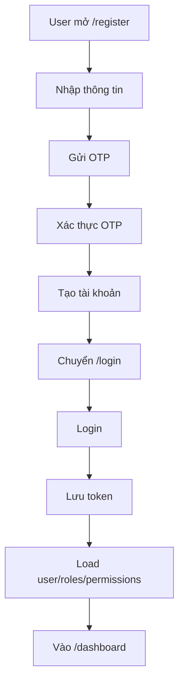
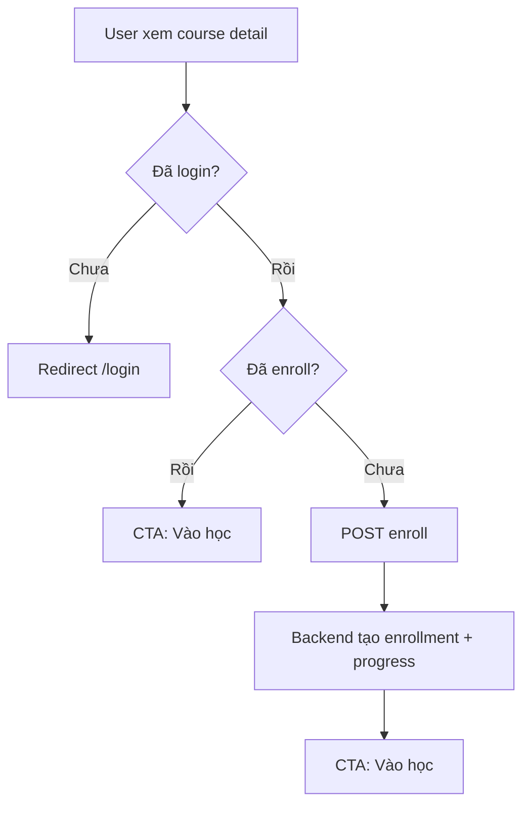
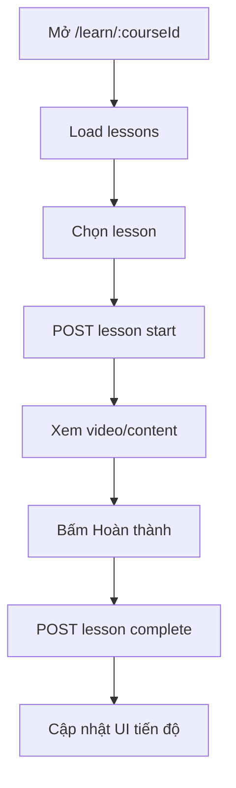
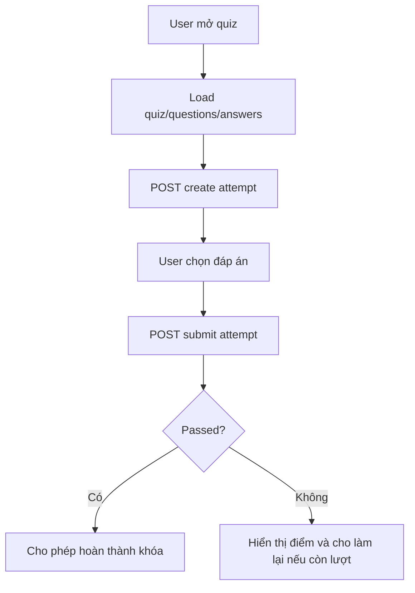
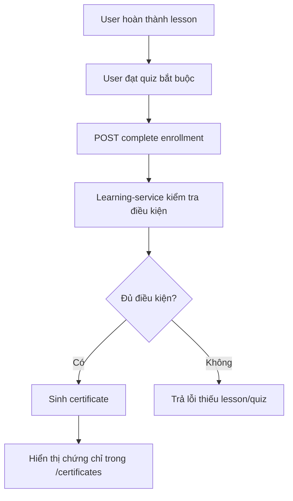

# LMS Mini - Student Frontend Render Specification

Tài liệu này dùng làm đầu vào để AI hoặc frontend developer render giao diện **Student Frontend** cho hệ thống LMS Mini. Mục tiêu là mô tả rõ màn hình cần có, tiêu chí UI/UX, luồng nghiệp vụ, API cần gọi, API thuộc service nào và trạng thái dữ liệu cần xử lý.

Frontend student nên gọi API qua **API Gateway**:

```txt
http://localhost:8080
```

Không gọi trực tiếp port service như `8081`, `8083`, `8084`, `8085`.

## 1. Định Hướng Sản Phẩm

Student frontend là cổng học tập dành cho học viên. Giao diện cần ưu tiên:

| Tiêu chí | Yêu cầu |
|---|---|
| Dễ học | Học viên vào là thấy khóa đang học, bài tiếp theo, tiến độ |
| Rõ trạng thái | Hiển thị enrolled/not enrolled, in progress/completed, quiz passed/failed, certificate active/expired |
| Ít thao tác | CTA chính rõ: Đăng nhập, Đăng ký, Vào học, Tiếp tục học, Làm quiz, Xem chứng chỉ |
| Responsive | Desktop, tablet, mobile đều dùng tốt |
| Tiếng Việt có dấu | Toàn bộ label, message, empty state, error đều dùng tiếng Việt |
| Không lộ API internal | Không gọi `/internal/v1/**` từ frontend |

## 2. Tech/UI Khuyến Nghị

| Hạng mục | Khuyến nghị |
|---|---|
| Framework | Next.js App Router |
| Styling | CSS module/global CSS hoặc Tailwind, nhưng cần thống nhất design system |
| Auth storage | Cookie hoặc localStorage, ưu tiên cookie nếu cần middleware route guard |
| API client | Một `apiClient` dùng chung, tự gắn `Authorization: Bearer <token>` |
| UI style | Sạch, hiện đại, giống nền tảng học online doanh nghiệp |
| Icon | `lucide-react` hoặc icon set đang dùng |
| Ảnh khóa học | Lấy từ API course primary image, fallback bằng màu/initial |

## 3. Quy Ước API

### 3.1 Request Wrapper

Các API create/update đa số nhận body dạng:

```json
{
  "data": {},
  "channel": "WEB",
  "signature": ""
}
```

Frontend nên có helper:

```ts
export function wrap<T>(data: T) {
  return { data, channel: "WEB", signature: "" };
}
```

### 3.2 Response Wrapper

Backend trả dạng:

```json
{
  "data": {},
  "status": "OK",
  "errorCode": "EV-200",
  "message": "OK"
}
```

Với page response:

```json
{
  "data": {
    "content": [],
    "totalElements": 0,
    "totalPages": 0,
    "number": 0,
    "size": 10
  }
}
```

### 3.3 Auth Header

Sau khi đăng nhập, mọi API cần auth gửi:

```txt
Authorization: Bearer <accessToken>
Accept-Language: vi
```

Các API student dạng `me`, `my-courses`, `start lesson`, `complete lesson`, `quiz attempt`, `my-certificates` lấy user hiện tại từ token. Frontend **không truyền userId** cho các luồng này.

## 4. Sitemap Student Frontend

| Route UI | Màn hình | Auth | Mục tiêu |
|---|---|---:|---|
| `/` | Landing / Home | No | Giới thiệu nền tảng, CTA đăng nhập/đăng ký/xem khóa học |
| `/login` | Đăng nhập | No | Login lấy token |
| `/register` | Đăng ký | No | Tạo tài khoản học viên |
| `/verify-otp` | Xác thực OTP | No | Xác thực email khi đăng ký |
| `/courses` | Catalog khóa học | Optional | Xem danh sách khóa học |
| `/courses/:courseId` | Chi tiết khóa học | Optional | Xem thông tin khóa, bài học, đăng ký khóa |
| `/dashboard` | Dashboard học viên | Yes | Tổng quan học tập cá nhân |
| `/my-courses` | Khóa học của tôi | Yes | Danh sách enrollment của user hiện tại |
| `/learn/:courseId` | Trình học khóa học | Yes | Học bài, xem lesson list, start/complete lesson |
| `/lessons/:lessonId` | Chi tiết bài học | Yes | Xem nội dung/video bài học |
| `/quiz/:quizId` | Làm quiz | Yes | Start attempt, chọn đáp án, submit |
| `/quiz-attempts/:attemptId/result` | Kết quả quiz | Yes | Xem passed/score/feedback |
| `/certificates` | Chứng chỉ của tôi | Yes | Danh sách chứng chỉ |
| `/certificates/:code` | Xác minh chứng chỉ | Optional | Tra cứu chứng chỉ theo code |
| `/profile` | Hồ sơ | Yes | Xem thông tin user hiện tại |
| `/change-password` | Đổi mật khẩu | Yes | Đổi mật khẩu user hiện tại |

## 5. API Theo Service

### 5.1 Authn Service

Gateway prefix thường dùng: `/auth`

| Method | API | Service | Auth | Mô tả nghiệp vụ |
|---|---|---|---:|---|
| POST | `/auth/login` | authn-service | No | Đăng nhập bằng username/password |
| POST | `/auth/token` | api-gateway alias -> authn-service | No | Alias login, nên dùng nếu gateway đã config |
| POST | `/auth/register` | authn-service | No | Đăng ký tài khoản học viên |
| POST | `/auth/otp-register` | authn-service | No | Gửi OTP đăng ký qua email |
| POST | `/auth/otp-verify` | authn-service | No | Xác thực OTP |
| POST | `/auth/me` | authn-service | Yes | Lấy thông tin user hiện tại |
| POST | `/auth/userinfo` | api-gateway alias -> authn-service | Yes | Alias lấy user hiện tại |
| POST | `/auth/introspect` | authn-service | Optional | Kiểm tra token còn hợp lệ |
| POST | `/auth/refresh-token` | authn-service | No | Refresh access token |
| POST | `/auth/refresh` | api-gateway alias -> authn-service | No | Alias refresh token |
| POST | `/auth/logout` | authn-service | Yes | Đăng xuất/thu hồi token |
| POST | `/auth/change-password` | authn-service | Yes | Đổi mật khẩu user hiện tại |

### 5.2 Author Service

Gateway prefix: `/author`

| Method | API | Service | Auth | Mô tả nghiệp vụ |
|---|---|---|---:|---|
| GET | `/author/api/v1/users/me/roles` | author-service | Yes | Lấy role hiện tại, dùng để xác định student |
| GET | `/author/api/v1/users/me/permissions` | author-service | Yes | Lấy permission hiện tại, dùng để ẩn/hiện chức năng |

Student frontend không cần gọi API staff/admin permission.

### 5.3 Course Service - Catalog, Course, Lesson, Image

Gateway prefix: `/course`

| Method | API | Service | Auth | Mô tả nghiệp vụ |
|---|---|---|---:|---|
| GET | `/course/api/v1/course-categories` | course-service | Optional | Lấy danh mục khóa học để filter catalog |
| GET | `/course/api/v1/courses` | course-service | Optional | Lấy danh sách khóa học, catalog |
| GET | `/course/api/v1/courses/published` | course-service | Public | Danh sách khóa học đã publish |
| GET | `/course/api/v1/courses/{id}/published` | course-service | Public | Chi tiết khóa học đã publish |
| GET | `/course/api/v1/courses/{id}/images` | course-service | Optional | Lấy metadata ảnh khóa học |
| GET | `/course/api/v1/courses/{id}/images/primary/view` | course-service | Optional | Xem ảnh chính khóa học |
| GET | `/course/api/v1/courses/{courseId}/lessons` | course-service | Optional/Yes | Lấy danh sách bài học theo khóa |
| GET | `/course/api/v1/lessons/{id}` | course-service | Yes | Chi tiết bài học |
| GET | `/course/api/v1/lesson-resources` | course-service | Yes | Lấy tài nguyên bài học bằng filter `lessonId` nếu backend filter hỗ trợ |
| GET | `/course/api/v1/lesson-resources/{id}` | course-service | Yes | Chi tiết tài nguyên bài học |
| GET | `/course/api/v1/images/{id}/view` | course-service | Optional | Xem ảnh theo imageId |
| GET | `/course/api/v1/images/{id}/download` | course-service | Optional | Tải ảnh theo imageId |

Gợi ý filter catalog:

```txt
GET /course/api/v1/courses?page=0&size=12
GET /course/api/v1/courses?categoryId={categoryId}&page=0&size=12
```

Chỉ hiển thị khóa học `PUBLISHED` cho student. Nếu backend chưa filter status ở API, frontend lọc tạm theo `status === "PUBLISHED"`.

### 5.4 Learning Service - Enrollment, Progress, Certificate

Gateway prefix: `/learning`

| Method | API | Service | Auth | Mô tả nghiệp vụ |
|---|---|---|---:|---|
| POST | `/learning/api/v1/courses/{courseId}/enroll` | learning-service | Yes | User hiện tại đăng ký khóa học |
| GET | `/learning/api/v1/my-courses` | learning-service | Yes | Lấy danh sách khóa học đã đăng ký của user hiện tại |
| POST | `/learning/api/v1/lessons/{lessonId}/start` | learning-service | Yes | Bắt đầu bài học, tạo/cập nhật learning progress thành `IN_PROGRESS` |
| POST | `/learning/api/v1/lessons/{lessonId}/complete` | learning-service | Yes | Hoàn thành bài học, cập nhật progress |
| POST | `/learning/api/v1/courses/{courseId}/complete` | learning-service | Yes | Hoàn thành khóa học, kiểm tra lesson/quiz và sinh chứng chỉ |
| GET | `/learning/api/v1/my-certificates` | learning-service | Yes | Lấy chứng chỉ của user hiện tại |
| GET | `/learning/api/v1/certificates/{code}` | learning-service | Optional/Yes | Xác minh chứng chỉ theo certificate code |

Luồng hoàn thành khóa học:

1. User học hết lesson.
2. User hoàn thành quiz bắt buộc nếu có.
3. Frontend gọi `/learning/api/v1/courses/{courseId}/complete`.
4. Backend kiểm tra điều kiện lesson progress + required quiz.
5. Nếu đạt, backend sinh certificate.

### 5.5 Quiz Service - Quiz, Question, Answer, Attempt

Gateway prefix: `/quiz`

| Method | API | Service | Auth | Mô tả nghiệp vụ |
|---|---|---|---:|---|
| GET | `/quiz/api/v1/quiz` | quiz-service | Yes | Lấy danh sách quiz, có thể filter `courseId`, `lessonId` |
| GET | `/quiz/api/v1/quiz/{id}` | quiz-service | Yes | Chi tiết quiz |
| GET | `/quiz/api/v1/questions` | quiz-service | Yes | Lấy danh sách câu hỏi, filter `quizId` |
| GET | `/quiz/api/v1/questions/{id}` | quiz-service | Yes | Chi tiết câu hỏi |
| GET | `/quiz/api/v1/answers` | quiz-service | Yes | Lấy danh sách đáp án, filter `questionId` |
| GET | `/quiz/api/v1/answers/{id}` | quiz-service | Yes | Chi tiết đáp án |
| POST | `/quiz/api/v1/quizzes/{id}/attempts` | quiz-service | Yes | Bắt đầu quiz attempt |
| POST | `/quiz/api/v1/quiz-attempts/{id}/submit` | quiz-service | Yes | Nộp bài quiz |

Gợi ý lấy quiz theo bài học:

```txt
GET /quiz/api/v1/quiz?lessonId={lessonId}
```

Gợi ý lấy câu hỏi và đáp án:

```txt
GET /quiz/api/v1/questions?quizId={quizId}&page=0&size=100
GET /quiz/api/v1/answers?questionId={questionId}&page=0&size=100
```

Lưu ý bảo mật UX:

| Vấn đề | Cách xử lý frontend |
|---|---|
| API answers có thể trả `correct` | Khi làm quiz không hiển thị field `correct` trong UI |
| Student xem đáp án đúng trước khi submit | Frontend phải bỏ qua `correct` khi render attempt |
| Kết quả submit | Chỉ hiển thị đúng/sai sau API submit trả kết quả |

## 6. Mô Tả Màn Hình Chi Tiết

### 6.1 Landing Page `/`

Mục tiêu:

- Giới thiệu nền tảng học tập.
- CTA: `Đăng nhập`, `Đăng ký`, `Xem khóa học`.
- Hiển thị một số khóa học nổi bật nếu gọi được API.

Sections:

| Section | Nội dung |
|---|---|
| Hero | Tên nền tảng, mô tả ngắn, CTA |
| Featured courses | 3-6 khóa học published |
| Learning benefits | Theo dõi tiến độ, quiz, chứng chỉ |
| Certificate verify | Ô nhập certificate code |

API:

| API | Service |
|---|---|
| `GET /course/api/v1/courses/published?page=0&size=6` | course-service |
| `GET /course/api/v1/courses/{id}/images/primary/view` | course-service |
| `GET /learning/api/v1/certificates/{code}` | learning-service |

### 6.2 Login `/login`

Fields:

| Field | Type | Required |
|---|---|---|
| username/email | text | Yes |
| password | password | Yes |

Flow:

1. User nhập username/password.
2. Gọi login.
3. Lưu token.
4. Gọi `/auth/userinfo`.
5. Gọi roles/permissions.
6. Redirect `/dashboard`.

API:

| API | Service |
|---|---|
| `POST /auth/token` hoặc `POST /auth/login` | authn-service |
| `POST /auth/userinfo` hoặc `POST /auth/me` | authn-service |
| `GET /author/api/v1/users/me/roles` | author-service |
| `GET /author/api/v1/users/me/permissions` | author-service |

UI states:

| State | UI |
|---|---|
| loading | Disable form, spinner |
| wrong credentials | Toast/error dưới form |
| expired session | Chuyển về login, message "Phiên đăng nhập đã hết hạn" |

### 6.3 Register `/register` Và OTP `/verify-otp`

Register fields:

| Field | Required |
|---|---:|
| firstName | Yes |
| lastName | Yes |
| email | Yes |
| username | Yes |
| password | Yes |
| phone | Optional |

Flow đề xuất:

1. `/register`: nhập thông tin.
2. Gọi `/auth/otp-register` với email.
3. Sang `/verify-otp`.
4. Gọi `/auth/otp-verify`.
5. Gọi `/auth/register`.
6. Sang `/login`.

API:

| API | Service |
|---|---|
| `POST /auth/otp-register` | authn-service |
| `POST /auth/otp-verify` | authn-service |
| `POST /auth/register` | authn-service |

### 6.4 Catalog `/courses`

Mục tiêu:

- Hiển thị danh sách khóa học đã publish.
- Filter theo danh mục.
- Search theo tên/mã khóa.
- Card khóa học có ảnh, tên, mô tả, level, duration, CTA.

API:

| API | Service | Mục đích |
|---|---|---|
| `GET /course/api/v1/course-categories` | course-service | Filter category |
| `GET /course/api/v1/courses/published` | course-service | Danh sách khóa học đã publish |
| `GET /course/api/v1/courses/{id}/images/primary/view` | course-service | Ảnh card |
| `GET /learning/api/v1/my-courses` | learning-service | Nếu logged in, đánh dấu khóa đã đăng ký |

UI card:

| Element | Nội dung |
|---|---|
| Thumbnail | Primary image hoặc fallback |
| Title | Course name |
| Category | Category name |
| Level | BEGINNER/INTERMEDIATE/ADVANCED |
| Duration | durationMinutes |
| Status CTA | `Xem chi tiết`, `Tiếp tục học` nếu đã enroll |

### 6.5 Course Detail `/courses/:courseId`

Mục tiêu:

- Xem chi tiết khóa.
- Xem lesson list.
- Đăng ký khóa học.
- Nếu đã đăng ký, CTA `Vào học`.

API:

| API | Service | Mục đích |
|---|---|---|
| `GET /course/api/v1/courses/{courseId}` | course-service | Chi tiết khóa |
| `GET /course/api/v1/courses/{courseId}/images/primary/view` | course-service | Ảnh khóa |
| `GET /course/api/v1/courses/{courseId}/lessons` | course-service | Danh sách bài học |
| `GET /learning/api/v1/my-courses` | learning-service | Kiểm tra đã enroll chưa |
| `POST /learning/api/v1/courses/{courseId}/enroll` | learning-service | Đăng ký khóa |

Enrollment flow:

1. Nếu chưa login: bấm `Đăng ký học` -> redirect `/login?redirect=/courses/{courseId}`.
2. Nếu đã login nhưng chưa enroll: gọi enroll.
3. Backend tạo enrollment và learning progress ban đầu.
4. UI chuyển CTA thành `Vào học`.

### 6.6 Dashboard `/dashboard`

Mục tiêu:

- Màn đầu tiên sau login.
- Hiển thị khóa đang học, bài học tiếp theo, quiz cần làm, chứng chỉ mới.

API:

| API | Service |
|---|---|
| `GET /learning/api/v1/my-courses` | learning-service |
| `GET /learning/api/v1/my-certificates` | learning-service |
| `GET /course/api/v1/courses/{id}/published` | course-service |
| `GET /course/api/v1/courses/{courseId}/lessons` | course-service |
| `GET /quiz/api/v1/quiz?courseId={courseId}` | quiz-service |

Widgets:

| Widget | Data |
|---|---|
| Khóa đang học | enrollment status ACTIVE |
| Tiến độ tổng | enrollment.progressPercent |
| Bài tiếp theo | lesson chưa completed, nếu backend chưa có list progress thì lấy lesson theo order và CTA vào học |
| Quiz bắt buộc | quiz.requiredToComplete |
| Chứng chỉ | latest certificate |

### 6.7 My Courses `/my-courses`

Mục tiêu:

- Hiển thị enrollment của user hiện tại.
- Mỗi item liên kết tới course detail hoặc learn page.

API:

| API | Service |
|---|---|
| `GET /learning/api/v1/my-courses` | learning-service |
| `GET /course/api/v1/courses/{courseId}` | course-service |
| `GET /course/api/v1/courses/{courseId}/images/primary/view` | course-service |

Card enrollment:

| Field | Source |
|---|---|
| Course name | course-service |
| Progress | enrollment.progressPercent |
| Status | enrollment.status |
| Enrolled date | enrollment.enrolledAt |
| Completed date | enrollment.completedAt |

### 6.8 Learn Page `/learn/:courseId`

Mục tiêu:

- Trình học bài chính.
- Layout gồm sidebar lesson list và content lesson.
- Start lesson khi mở bài.
- Complete lesson khi user bấm hoàn thành.

API:

| API | Service | Mục đích |
|---|---|---|
| `GET /course/api/v1/courses/{courseId}` | course-service | Header khóa học |
| `GET /course/api/v1/courses/{courseId}/lessons` | course-service | Sidebar bài học |
| `GET /course/api/v1/lessons/{lessonId}` | course-service | Nội dung bài học |
| `POST /learning/api/v1/lessons/{lessonId}/start` | learning-service | Bắt đầu bài |
| `POST /learning/api/v1/lessons/{lessonId}/complete` | learning-service | Hoàn thành bài |
| `GET /quiz/api/v1/quiz?lessonId={lessonId}` | quiz-service | Quiz liên quan bài học |

UI layout:

| Vùng | Mô tả |
|---|---|
| Sidebar | Danh sách lesson, trạng thái lock/in progress/completed nếu có data |
| Main content | Video/content/text |
| Bottom actions | Bài trước, Hoàn thành bài, Bài tiếp theo |
| Quiz callout | Nếu lesson có quiz, CTA `Làm quiz` |

Lưu ý:

- Nếu backend chưa có API list learning progress per lesson, UI có thể dùng `progressPercent` cấp enrollment để hiển thị tổng quan.
- Không tự đánh completed ở frontend nếu API complete lỗi.

### 6.9 Quiz Attempt `/quiz/:quizId`

Mục tiêu:

- User làm quiz.
- Không hiển thị đáp án đúng trước khi submit.
- Submit answer và nhận kết quả.

API:

| API | Service | Mục đích |
|---|---|---|
| `GET /quiz/api/v1/quiz/{quizId}` | quiz-service | Chi tiết quiz |
| `GET /quiz/api/v1/questions?quizId={quizId}` | quiz-service | Câu hỏi |
| `GET /quiz/api/v1/answers?questionId={questionId}` | quiz-service | Đáp án |
| `POST /quiz/api/v1/quizzes/{quizId}/attempts` | quiz-service | Bắt đầu attempt |
| `POST /quiz/api/v1/quiz-attempts/{attemptId}/submit` | quiz-service | Nộp bài |

Submit payload cần theo backend hiện tại. Nếu DTO submit là danh sách answerId, UI nên lưu selected answer theo question.

UI states:

| State | UI |
|---|---|
| not started | Button `Bắt đầu quiz` |
| in progress | Câu hỏi, timer nếu có |
| submitting | Disable submit |
| passed | Kết quả xanh, CTA về khóa học |
| failed | Kết quả đỏ, CTA làm lại nếu còn attempt |

### 6.10 Certificates `/certificates`

Mục tiêu:

- Xem chứng chỉ của user hiện tại.
- Tra cứu chứng chỉ theo code.

API:

| API | Service |
|---|---|
| `GET /learning/api/v1/my-certificates` | learning-service |
| `GET /learning/api/v1/certificates/{code}` | learning-service |
| `GET /course/api/v1/courses/{courseId}` | course-service |

Card certificate:

| Field | Source |
|---|---|
| certificateCode | learning-service |
| course name | course-service |
| issuedAt | learning-service |
| status | learning-service |
| userId | learning-service |

Status display:

| Status | UI |
|---|---|
| ACTIVE | Còn hiệu lực |
| EXPIRED | Hết hạn |
| REVOKED | Đã thu hồi |

### 6.11 Profile `/profile`

Mục tiêu:

- Xem thông tin user hiện tại.
- Avatar upload nếu backend user image hoàn thiện sau.

API:

| API | Service |
|---|---|
| `POST /auth/me` hoặc `/auth/userinfo` | authn-service |
| `GET /author/api/v1/users/me/roles` | author-service |
| `GET /author/api/v1/users/me/permissions` | author-service |

### 6.12 Change Password `/change-password`

Mục tiêu:

- User đổi mật khẩu.

API:

| API | Service |
|---|---|
| `POST /auth/change-password` | authn-service |

Fields:

| Field | Required |
|---|---:|
| oldPassword | Yes |
| newPassword | Yes |
| confirmPassword | Yes |

## 7. Luồng Nghiệp Vụ Chính

### 7.1 Đăng Ký Và Đăng Nhập



### 7.2 Đăng Ký Khóa Học



### 7.3 Học Bài



### 7.4 Làm Quiz Bắt Buộc



### 7.5 Hoàn Thành Khóa Và Sinh Chứng Chỉ



## 8. API Client Gợi Ý

```ts
const BASE_URL = process.env.NEXT_PUBLIC_API_GATEWAY_URL || "http://localhost:8080";

export async function apiClient<T>(endpoint: string, options: RequestInit = {}): Promise<T> {
  const token = getToken();
  const headers = new Headers(options.headers);

  if (!headers.has("Content-Type") && !(options.body instanceof FormData)) {
    headers.set("Content-Type", "application/json");
  }
  headers.set("Accept-Language", "vi");
  if (token) headers.set("Authorization", `Bearer ${token}`);

  const res = await fetch(`${BASE_URL}${endpoint}`, { ...options, headers });
  const json = await res.json().catch(() => null);

  if (!res.ok || (json?.errorCode && json.errorCode !== "EV-200")) {
    throw new Error(json?.message || "Có lỗi xảy ra");
  }

  return json?.data ?? json;
}
```

## 9. Service Frontend Gợi Ý

### 9.1 auth.service.ts

```ts
export const authService = {
  login: (payload) => apiClient("/auth/token", { method: "POST", body: JSON.stringify(payload) }),
  register: (data) => apiClient("/auth/register", { method: "POST", body: JSON.stringify({ data, channel: "WEB", signature: "" }) }),
  me: () => apiClient("/auth/userinfo", { method: "POST" }),
  logout: (token) => apiClient("/auth/logout", { method: "POST", body: JSON.stringify({ token }) }),
  changePassword: (data) => apiClient("/auth/change-password", { method: "POST", body: JSON.stringify({ data, channel: "WEB", signature: "" }) }),
};
```

### 9.2 course.service.ts

```ts
export const courseService = {
  getCategories: (params) => apiClient(`/course/api/v1/course-categories?${toQuery(params)}`),
  getCourses: (params) => apiClient(`/course/api/v1/courses?${toQuery(params)}`),
  getCourse: (id) => apiClient(`/course/api/v1/courses/${id}`),
  getLessonsByCourse: (courseId, params) => apiClient(`/course/api/v1/courses/${courseId}/lessons?${toQuery(params)}`),
  getLesson: (id) => apiClient(`/course/api/v1/lessons/${id}`),
};
```

### 9.3 learning.service.ts

```ts
export const learningService = {
  enrollCourse: (courseId) => apiClient(`/learning/api/v1/courses/${courseId}/enroll`, { method: "POST", body: JSON.stringify({ data: {}, channel: "WEB", signature: "" }) }),
  getMyCourses: (params) => apiClient(`/learning/api/v1/my-courses?${toQuery(params)}`),
  startLesson: (lessonId) => apiClient(`/learning/api/v1/lessons/${lessonId}/start`, { method: "POST" }),
  completeLesson: (lessonId) => apiClient(`/learning/api/v1/lessons/${lessonId}/complete`, { method: "POST" }),
  completeCourse: (courseId) => apiClient(`/learning/api/v1/courses/${courseId}/complete`, { method: "POST" }),
  getMyCertificates: (params) => apiClient(`/learning/api/v1/my-certificates?${toQuery(params)}`),
  verifyCertificate: (code) => apiClient(`/learning/api/v1/certificates/${code}`),
};
```

### 9.4 quiz.service.ts

```ts
export const quizService = {
  getQuizzes: (params) => apiClient(`/quiz/api/v1/quiz?${toQuery(params)}`),
  getQuiz: (id) => apiClient(`/quiz/api/v1/quiz/${id}`),
  getQuestions: (quizId) => apiClient(`/quiz/api/v1/questions?quizId=${quizId}&page=0&size=100`),
  getAnswers: (questionId) => apiClient(`/quiz/api/v1/answers?questionId=${questionId}&page=0&size=100`),
  startAttempt: (quizId) => apiClient(`/quiz/api/v1/quizzes/${quizId}/attempts`, { method: "POST" }),
  submitAttempt: (attemptId, data) => apiClient(`/quiz/api/v1/quiz-attempts/${attemptId}/submit`, { method: "POST", body: JSON.stringify({ data, channel: "WEB", signature: "" }) }),
};
```

## 10. Component Gợi Ý

| Component | Dùng ở màn | Mô tả |
|---|---|---|
| `StudentShell` | protected routes | Header, nav, user menu, logout |
| `AuthGuard` | protected routes | Chặn route chưa login |
| `CourseCard` | catalog, dashboard, my-courses | Card khóa học |
| `CourseHero` | course detail | Header chi tiết khóa |
| `LessonSidebar` | learn page | Danh sách bài học |
| `LessonPlayer` | learn page | Video/content bài học |
| `ProgressBar` | dashboard, my-courses | Hiển thị tiến độ |
| `QuizQuestionCard` | quiz attempt | Câu hỏi + đáp án |
| `CertificateCard` | certificates | Card chứng chỉ |
| `EmptyState` | mọi list | Khi chưa có dữ liệu |
| `ErrorState` | mọi page | Khi API lỗi |
| `LoadingSkeleton` | mọi page | Khi đang tải |

## 11. Permission/Role Cho Student

Student cần các quyền:

| Nhóm | Permission |
|---|---|
| User | `USER_PROFILE_VIEW`, `USER_PASSWORD_CHANGE` |
| Course/Lesson | `COURSE_VIEW`, `CATEGORY_VIEW`, `LESSON_VIEW`, `RESOURCE_VIEW`, `IMAGE_VIEW` |
| Enrollment | `ENROLLMENT_VIEW`, `ENROLLMENT_ENROLL` |
| Learning | `LEARNING_PROGRESS_VIEW`, `LEARNING_PROGRESS_UPDATE` |
| Quiz | `QUIZ_VIEW`, `QUIZ_ATTEMPT` |
| Certificate | `CERTIFICATE_VIEW`, `CERTIFICATE_VERIFY` |

Frontend vẫn nên render theo role/permission, nhưng backend mới là nơi chặn thật bằng `@PreAuthorize`.

## 12. Empty/Error State Cần Có

| Trường hợp | Message |
|---|---|
| Chưa có khóa học | Chưa có khóa học phù hợp. |
| Chưa enroll khóa nào | Bạn chưa đăng ký khóa học nào. |
| Khóa chưa có bài học | Khóa học này chưa có bài học. |
| Lesson load lỗi | Không tải được bài học. Vui lòng thử lại. |
| Quiz chưa có câu hỏi | Quiz này chưa có câu hỏi. |
| Submit quiz lỗi | Không nộp được bài quiz. Vui lòng thử lại. |
| Certificate không tồn tại | Không tìm thấy chứng chỉ với mã này. |
| 401 | Phiên đăng nhập đã hết hạn. Vui lòng đăng nhập lại. |
| 403 | Bạn không có quyền thực hiện thao tác này. |

## 13. Backend Gaps Cần Lưu Ý

Các điểm sau nếu muốn frontend student hoàn chỉnh hơn thì nên bổ sung backend:

| Gap | Ảnh hưởng frontend | API đề xuất |
|---|---|---|
| Chưa có API list progress theo enrollment/course | Learn page khó biết lesson nào completed | `GET /learning/api/v1/courses/{courseId}/progress` |
| Answers API trả field `correct` | Có nguy cơ lộ đáp án nếu frontend không cẩn thận | Tạo endpoint attempt-safe không trả `correct` |
| Chưa có API result detail attempt rõ ràng trong danh sách hiện tại | Màn kết quả quiz khó render chi tiết | `GET /quiz/api/v1/quiz-attempts/{id}` |
| Chưa có API danh sách attempt của user | Không xem lịch sử làm quiz | `GET /quiz/api/v1/my-quiz-attempts` |
| API public course chỉ published | Catalog dùng trực tiếp | `GET /course/api/v1/courses/published` |

## 14. Ưu Tiên Implement Theo Phase

### Phase 1 - Auth

- `/login`
- `/register`
- `/verify-otp`
- Auth context
- Token storage
- Route guard
- Logout

### Phase 2 - Course Catalog

- `/courses`
- `/courses/:courseId`
- Course image
- Category filter
- Enroll course

### Phase 3 - Learning

- `/dashboard`
- `/my-courses`
- `/learn/:courseId`
- Start/complete lesson
- Progress display

### Phase 4 - Quiz

- `/quiz/:quizId`
- Start attempt
- Render questions/answers
- Submit attempt
- Result screen

### Phase 5 - Certificate/Profile

- `/certificates`
- `/certificates/:code`
- `/profile`
- `/change-password`

## 15. Render Checklist

Trước khi coi là xong, frontend student cần đạt:

- [ ] Tất cả text tiếng Việt có dấu.
- [ ] Login/logout hoạt động.
- [ ] Token được gắn vào API auth-required.
- [ ] Catalog khóa học có loading/error/empty.
- [ ] Course detail có lesson list và enroll CTA.
- [ ] My courses lấy từ `/learning/api/v1/my-courses`.
- [ ] Learn page gọi start/complete lesson.
- [ ] Quiz attempt không hiển thị đáp án đúng trước submit.
- [ ] Certificate verify theo code hoạt động.
- [ ] Mobile không vỡ layout.
- [ ] 401 tự logout hoặc redirect login.
- [ ] 403 hiển thị không có quyền.
